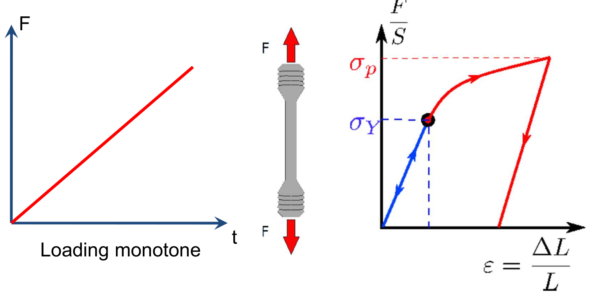
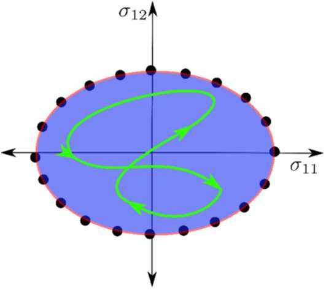
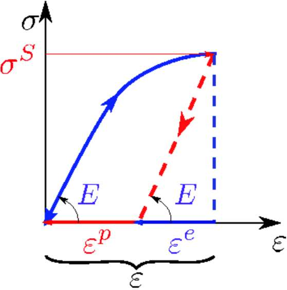
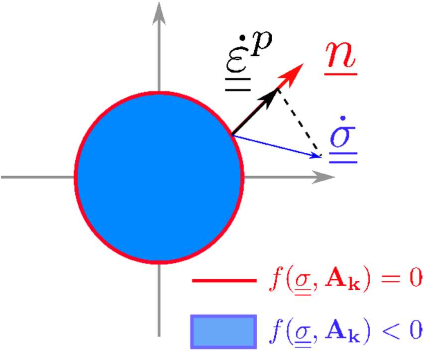
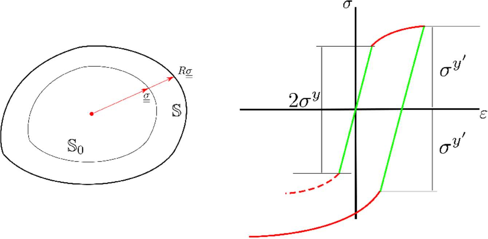
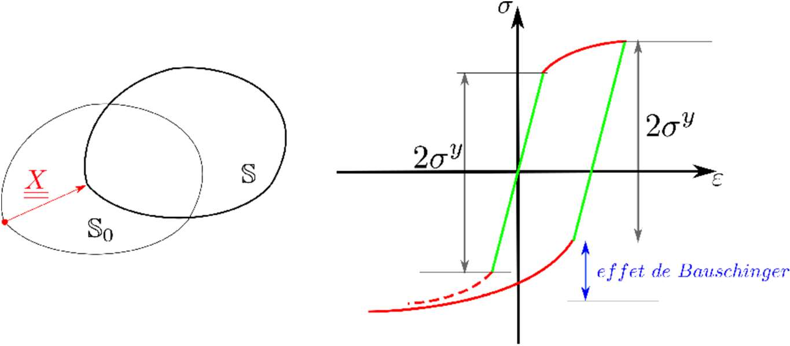
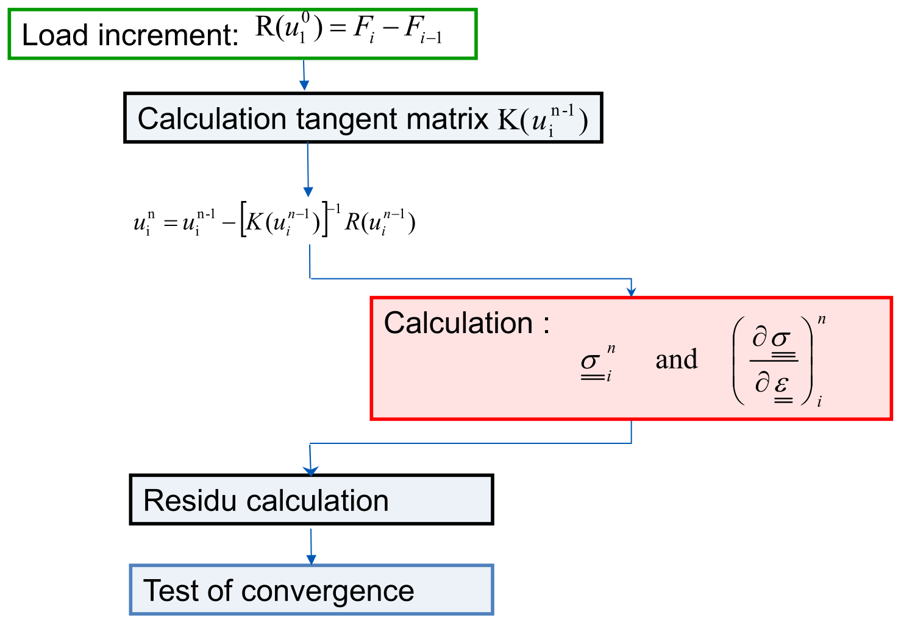

# Local resolution of constitutive laws — Simvia web edition

A Modified Version of **"Local resolution of constitutive laws"**, *code_aster /
salome_meca* course material authored and published by **EDF S.A.** under the GNU
Free Documentation License. The content and the figures are the original course,
unchanged; only the layout is new.

**Authors:** EDF S.A. (the original course material);
[Simvia](https://simvia.tech/fr) (the modifications).

**Publisher of this Modified Version:** Simvia.

Copyright © 2026 Simvia, for the modifications. The original course material
carries no copyright notice.

Permission is granted to copy, distribute and/or modify this document under the
terms of the GNU Free Documentation License, Version 1.3 or any later version
published by the Free Software Foundation; with no Invariant Sections, no
Front-Cover Texts, and no Back-Cover Texts. A copy of the license is included in
the section entitled "GNU Free Documentation License".

---

The course runs in four parts, in the order the original deck presents them:

| | Part | What it covers |
|---|---|---|
| 1 | [General concepts](#part-1--general-concepts) | why a behaviour law is needed, and how a plasticity model is built |
| 2 | [Solving behaviour laws](#part-2--solving-behaviour-laws) | the algorithm code_aster runs, and where it sits in the global loop |
| 3 | [Behaviour laws in code_aster](#part-3--behaviour-laws-in-code_aster) | the catalogue of available laws |
| 4 | [Syntax in code_aster](#part-4--syntax-in-code_aster) | the `COMPORTEMENT` keywords that drive the integration |
| — | [Conclusion](#conclusion) | where the documentation lives |

---

## Part 1 · General concepts

> **In this part**
> [Why a behaviour law](#why-a-behaviour-law) ·
> [Example: a metal in a 1D tensile test](#example-a-metal-in-a-1d-tensile-test) ·
> [A general theoretical framework](#a-general-theoretical-framework) ·
> [A formalism for plasticity](#a-formalism-for-plasticity) ·
> [Hardening](#hardening) ·
> [The final system to solve](#the-final-system-to-solve)
>
> *Original deck: slides 2–17.*

### Why a behaviour law

Consider a solid $\Omega$ in equilibrium with external forces:

$$
\int_\Omega \underline{\underline{\sigma}}(\vec{u}) : \underline{\underline{\varepsilon}}(\delta\vec{u})\,d\Omega
= \int_\Omega \vec{f}(\vec{u}) : \delta\vec{u}\,d\Omega
+ \int_{\Gamma_g} g(\vec{u}) : \delta\vec{u}\,d\Gamma
$$

| In 3D | Count |
|---|---|
| Unknowns — displacement field | 3 components |
| Unknowns — stress field | 6 components |
| Equations — (weak) equilibrium | 3 equations |

**Six equations are missing** ⟹ a behaviour law is required to close the system.

Building the behaviour law is a cycle, not a sequence — testing sends you back
to identification:

1. **Identify** from experimental: from try to complete structure
   (representativity).
2. Using **formalism** (general prooves for convergence).
3. **Develop** in non-linear framework.
4. **Test** (verification and validation).

### Example: a metal in a 1D tensile test

Behaviour law for metal from 1D tensile-test (plasticity).

#### 1/ Elaborate a representative *try*

  
   
  <em>Slide 6 — monotone loading, the specimen, and the response it produces.</em>

We can observe:

- an elasticity domain with a Yield Stress $\sigma^Y$;
- an irreversible strain $\varepsilon^P$;
- a hardening caracterized by $\sigma^P > \sigma^Y$;
- plasticity, a phenomenon that is independent of velocity.

#### 2/ Identify to extend to the REV (Representative Elementary Volume)

**First part: the elastic domain until $\sigma^Y$.** The elasticity domain is
defined by

$$
f(\underline{\underline{\sigma}}) < 0
$$

  
   
  <em>Slide 7 — the elasticity domain in stress space.</em>

Experimentaly:

- $f$ is a function of $\underline{\underline{\sigma}}^D = \mathrm{dev}(\underline{\underline{\sigma}})$
- more particulary $f(\underline{\underline{\sigma}}^D) = f(J_1, J_2)$

with

$$
J_1 = \frac{1}{2}\,\mathrm{dev}(\underline{\underline{\sigma}}) . \mathrm{dev}(\underline{\underline{\sigma}}),
\qquad
J_2 = \frac{1}{3}\,trac\!\left(\mathrm{dev}(\underline{\underline{\sigma}}) . \mathrm{dev}(\underline{\underline{\sigma}}) . \mathrm{dev}(\underline{\underline{\sigma}})\right)
$$

**Second part: the plastic domain from $\sigma^Y$.** The partition of strains:

$$
\underline{\underline{\varepsilon}} = \underline{\underline{\varepsilon}}^e + \underline{\underline{\varepsilon}}^p
$$

  
   
  <em>Slide 8 — unloading is parallel to the elastic branch, which splits the
  total strain into <code>εp</code> and <code>εe</code>.</em>

For elastic case:

$$
\underline{\underline{\sigma}} = \underline{\underline{\underline{\underline{E}}}} : \underline{\underline{\varepsilon}}^e
\quad\Longleftrightarrow\quad
\underline{\underline{\sigma}} = \lambda\,tr(\underline{\underline{\varepsilon}}^e) + 2\mu.\underline{\underline{\varepsilon}}^e
$$

### A general theoretical framework

**Mechanics and thermodynamics.** First law of thermodynamics:

$$
\frac{\partial E_{\mathrm{int}}}{\partial t} + \frac{\partial E_{cin}}{\partial t} = P_{ext} + Q_{ext}
$$

With PPV, we can formulate a variational internal energy:

$$
\rho\,\frac{\partial e}{\partial t} = \underline{\underline{\sigma}} : \dot{\underline{\underline{\varepsilon}}} + r - div(\underline{q})
$$

The second law of thermodynamics: the Inegality of Clausius-Duhem

$$
D = \underline{\underline{\sigma}} : \dot{\underline{\underline{\varepsilon}}}
- \rho\left(\frac{d\Psi}{dt} - s\dot{T}\right)
- \frac{\underline{q}}{T}.\nabla T \;\ge\; 0
$$

with $\Psi$ the Helmholtz's free energy.

> **The method of local state**
>
> The thermodynamic state, at the point and the instant considered, is entirely
> defined at this instant by the state variables (observable
> $(T, \underline{\underline{\varepsilon}})$ and internal
> $(V_1 = \underline{\underline{\varepsilon}}^p, V_k)$).

$$
\frac{d\Psi}{dt} = \frac{\partial\Psi}{\partial\underline{\underline{\varepsilon}}^e}\,\dot{\underline{\underline{\varepsilon}}}^e
+ \frac{\partial\Psi}{\partial T}\,\dot{T}
+ \frac{\partial\Psi}{\partial V_k}\,\dot{V_k}
$$

$$
D_{\mathrm{int}} = \left(\underline{\underline{\sigma}} - \rho\frac{d\Psi}{d\underline{\underline{\varepsilon}}^e}\right) : \dot{\underline{\underline{\varepsilon}}}^e
+ \underline{\underline{\sigma}} : \dot{\underline{\underline{\varepsilon}}}^p
- \rho\left(s + \frac{d\Psi}{dt}\right)
- \frac{d\Psi}{dV_k}.\dot{V_k}
$$

| If | Then |
|---|---|
| $\dot{\underline{\underline{\varepsilon}}}^p = \dot{V}^k = \dot{T} = 0$ | **the first state law:** $\underline{\underline{\sigma}} = \rho\dfrac{\partial\Psi}{\partial\underline{\underline{\varepsilon}}^e}$ |
| $\dot{\underline{\underline{\varepsilon}}}^p = \dot{V}^k = 0,\ \forall\,\dot{T}$ | **the second state law:** $s = -\dfrac{\partial\Psi}{\partial T}$ |

Collecting the state variables, their associated forces and the state laws:

<table>
  <thead>
    <tr>
      <th colspan="2" align="center">State Variables</th>
      <th rowspan="2" align="center">Associated thermodynamic forces</th>
      <th rowspan="2" align="center">State laws</th>
    </tr>
    <tr>
      <th align="center">observable</th>
      <th align="center">internal</th>
    </tr>
  </thead>
  <tbody>
    <tr>
      <td align="center">T</td>
      <td></td>
      <td align="center">s</td>
      <td align="center">s = −∂Ψ/∂T</td>
    </tr>
    <tr>
      <td align="center">εe</td>
      <td></td>
      <td align="center">σ</td>
      <td align="center">σ = ρ ∂Ψ/∂εe</td>
    </tr>
    <tr>
      <td></td>
      <td align="center">εp</td>
      <td align="center">−σ</td>
      <td align="center">σ = −ρ ∂Ψ/∂εp</td>
    </tr>
    <tr>
      <td></td>
      <td align="center">Vk</td>
      <td align="center">Ak</td>
      <td align="center">Ak = ρ ∂Ψ/∂Vk</td>
    </tr>
  </tbody>
</table>

Evolution of internal state variables ⟹ irreversible dissipation formalism.

### A formalism for plasticity

**The maximum plastic work (Hill 1951).** In short, the principle postulate two
important ideas:

- the yield surface must be convex function,
- the plastic strain rate is normal to the yield surface

  
   
  <em>Slide 12 — the plastic strain rate is normal to the yield surface.</em>

| Evolution law (or law of normality) | Outward normal to the boundary of the domain |
|---|---|
| $\dot{\underline{\underline{\varepsilon}}}^p = \dot\lambda\dfrac{\partial f}{\partial\sigma}$ | $\underline{n} = \dfrac{\partial f}{\partial\sigma}$ |

**Intensity of the flow.** The plasticity multiplier is determined by the
consistency relation:

$$
df = 0 \quad\Longleftrightarrow\quad \frac{\partial f}{\partial A_k}\,dA_k = 0
\qquad\Longrightarrow\qquad \boxed{\;\dot{f} \equiv 0\;}
$$

**Summary, a plasticity theory:**

- Defining hardening
- Defining yield surface
- Defining flow direction (normal = associative law)
- Défining flow intensity (plastic multiplicator)

### Hardening

#### Isotropic hardening

  
   
  <em>Slide 15 — the elasticity domain dilates.</em>

$$
f(\underline{\underline{\sigma}}, p) = \sqrt{\frac{3}{2}}\left\|\underline{\underline{\sigma}}^D\right\| - R(p) - \sigma^y
$$

An **isotropic** extension of the elasticity domain is taking into account:

- **Dilatation** of the elasticity domain
- Evolution of criterion is governed by a single **scalar** (internal state
  variable: cumulated plastic strain)

#### Kinematic hardening

  
   
  <em>Slide 16 — the elasticity domain translates, which produces the
  Bauschinger effect.</em>

$$
f(\sigma, p) = \left\|\underline{\underline{\sigma}}^D - \underline{X}\right\| - \sigma_y
$$

An **translation** of the elasticity domain is taking into account:

- **Translation** of the elasticity domain
- Evolution of criterion is governed by a **tensor** (internal state variable:
  centre of the elasticity domain)

### The final system to solve

The first two rows are common to both models, as in the original: they span the
full width. Below them, the left column is isotropic hardening and the right
column kinematic.

<table>
  <thead>
    <tr>
      <th></th>
      <th align="center">Isotropic hardening</th>
      <th align="center">Kinematic hardening</th>
    </tr>
  </thead>
  <tbody>
    <tr>
      <th align="left">Partition of strains</th>
      <td colspan="2" align="center">ε = εe + εp</td>
    </tr>
    <tr>
      <th align="left">Elastic strains</th>
      <td colspan="2" align="center">σ = λ tr(εe) + 2μ·εe</td>
    </tr>
    <tr>
      <th align="left">Plasticity criterion</th>
      <td align="center">f(σ, p) = √(3/2)·‖σD‖ − R(p) − σy</td>
      <td align="center">f(σ, p) = ‖σD − X‖ − σy</td>
    </tr>
    <tr>
      <th align="left">Flow law (normality)</th>
      <td align="center">ε̇p = √(3/2)·ṗ·σD ⁄ ‖σD‖</td>
      <td align="center">ε̇p = √(3/2)·ṗ·(σD − X) ⁄ ‖σD − X‖</td>
    </tr>
    <tr>
      <td></td>
      <td colspan="2" align="center">
        ṗ &gt; 0 &nbsp;if&nbsp; f(σ, p) = 0 &nbsp;&nbsp;·&nbsp;&nbsp;
        ṗ = 0 &nbsp;if&nbsp; f(σ, p) &lt; 0
      </td>
    </tr>
    <tr>
      <th align="left">Material parameters</th>
      <td align="center">R(p)</td>
      <td align="center">C, &nbsp;with X = C·ε̇p</td>
    </tr>
  </tbody>
</table>

[▲ back to the four parts](#local-resolution-of-constitutive-laws)

---

## Part 2 · Solving behaviour laws

> **In this part**
> [The functional and the global loop](#the-functional-and-the-global-loop) ·
> [Time discretisation](#time-discretisation) ·
> [Example of algorithm](#example-of-algorithm) ·
> [Integration of constitutive laws: sum up](#integration-of-constitutive-laws-sum-up)
>
> *Original deck: slides 18–24.*

### The functional and the global loop

**Algorithm:**

1. Define functional
2. Solve functional

Behaviour law is a functional for stress from strains, external state variables
(temperature…) and internal state variables

$$
\underline{\underline{\sigma}} = F\!\left(\underline{\underline{\varepsilon}}, T, V_k\right)
$$

Newton's method: need jacobian too!

$$
\left(\frac{\partial\underline{\underline{\sigma}}}{\partial\underline{\underline{\varepsilon}}}\right)
$$

  
   
  <em>Slide 20 — the red box is the local resolution: it runs once per Gauss
  point per iteration, and returns both the stress and the tangent operator.</em>

### Time discretisation

From ODE equations ⟹ time discretization.

- Implicit choice: stability
- The choice of the time step depends on the **radial** nature of the problem
- Unknown variables at time step: **incremental** scheme for stress

$$
\left(\Delta\underline{\underline{\varepsilon}}, V_k^-\right) \xrightarrow{\;F_\sigma\;} \Delta\underline{\underline{\sigma}}
\quad\Longrightarrow\quad
\underline{\underline{\sigma}}^+ = \underline{\underline{\sigma}}^- + \Delta\underline{\underline{\sigma}}
$$

- Scheme for internal state variables

$$
\left(\Delta\underline{\underline{\varepsilon}}, V_k^-\right) \xrightarrow{\;F_V\;} V_k^+
$$

**Incremental choice for stress update: only for small strains!**
$F_V$ and $F_\sigma$ are non-linear functionals to solve.

### Example of algorithm

  
   
  <em>Slide 22 — the test, its two branches, and the same step drawn in the
  deviatoric plane.</em>

Depending of $F_V$ and $F_\sigma$:

- (pseudo)-time integration: implicit or explicit (code_aster: mainly implicit)
- Non-linear solving: Newton's method, line-search, …
- **Warning! Hypothesis to solve non-linear equation!**
  Implicit algorithm ⟹ unconditional stability BUT when solve ODE using
  RADIAL hypothesis of loads
- Parameters for non-linear solving of behaviours laws:
  - In the `COMPORTEMENT` keyword
  - Sometimes, you can choose local non-linear algorithm to solve

### Integration of constitutive laws: sum up

**General non-linear algorithm:**

- In practice, only a few laws in *code_aster*
- Solving the **NL local system** of *n* equations
- Explicit method (Runge-Kutta) or implicit method (Newton)

**Specific non-linear algorithms:**

- For some laws (in fact, most of the laws in *code_aster*!)
- The system is reduced to **one single scalar equation**
- Solved by various methods (secant, Newton, Dekker, Brent)
- **Analytical** solution for some laws (ex: Von Mises isotropic hardening and /
  or linear kinematic)

[▲ back to the four parts](#local-resolution-of-constitutive-laws)

---

## Part 3 · Behaviour laws in code_aster

> **In this part**
> [Constitutive laws available](#constitutive-laws-available) ·
> [2D and 3D continuum media](#2d-and-3d-continuum-media) ·
> [Beyond continuum media](#beyond-continuum-media)
>
> *Original deck: slides 25–30.*

### Constitutive laws available

More than **160 laws** in the 13 stable version.

**Various fields of applications**

- Metals, polycrystalline metals
- Concrete
- Soils

**Various phenomena**

- Irradiation
- Damage or cracking
- Metallurgical phases

**Documentation**

- Synthesis of non-linear constitutive laws: **U4.51.11**
- `DEFI_MATERIAU` syntax: **U4.43.01**

### 2D and 3D continuum media

| Family | Laws |
|---|---|
| **Non linear elasticity** — Von Mises isotropic Pseudo-hardening | `ELAS_VMIS_LINE`, `ELAS_VMIS_TRAC`, `ELAS_HYPER` |
| **Incremental elasto-plasticity** — Von Mises isotropic hardening, kinematic linear, mixed | `VMIS_ISOT_TRAC`, `VMIS_ISOT_PUIS`, `VMIS_ISOT_LINE`, `VMIS_CINE_LINE`, `VMIS_ECMI_TRAC`, `VMIS_ECMI_LINE` |
| **Other elastoplastic models** (metals) | `VMIS_CIN1_CHAB`, `VMIS_CIN2_CHAB`, `VMIS_CIN2_MEMO` |
| **Elasto-visco-plasticity** (metals) | `LEMAITRE`, `LEMA_SEUIL`, `VISC_CIN1_CHAB`, `VISC_CIN2_CHAB`, `VISC_ISOT_LINE`, `VISC_ISOT_TRAC`, `VISC_TAHERI`, `VISCOCHAB` |
| **Limit loads** | `NORTON_HOFF` |
| **Polycrystalline metals** | `POLY_CFC`, `MONOCRISTAL`, `POLYCRISTAL` |
| **Elasto-visco-plasticity under irradiation** | `LMARC`, `LEMAITRE_IRRA`, `GATT_MONNERIE`, `VISC_IRRA_LOG`, `GRAN_IRRA_LOG`, `IRRAD3M` |
| **Damage or cracking of metals** | `ENDO_FRAGILE`, `VENDOCHAB`, `ROUSSELIER`, `ROUSS_PR`, `ROUSS_VISC`, `RUPT_FRAG`, `BARENBLATT` |
| **Concrete** | `BETON_DOUBLE_DP`, `GRANGER_FP`, `GRANGER_FP_V`, `GRANGER_FP_INDT`, `BAZANT_FP`, `ENDO_ISOT_BETON`, `ENDO_ORTH_BETON`, `MAZARS`, `JOINT_BA`, `CORR_ACIER`, `KIT_DDI`, `BETON_REGLE_PR`, `BETON_UMLV_FP`, `BETON_BURGER_FP`, `BETON_RAG` |
| **Soils and geomaterials** | `DRUCK_PRAGER(N_A)`, `CAM_CLAY`, `BARCELONE`, `CJS`, `HUJEUX`, `LAIGLE`, `LETK`, `HOEK_BROWN`, `KIT_HM`, `KIT_HHM`, `KIT_THH`, `KIT_THM`, `KIT_THHM` |

**Metallurgical phases** (elasto-visco-plastic) for steel or zirconium:
`META_X_Y_Z` where

- `X` = `P` (plasticity) or `V` (viscosity)
- `Y` = `IL` (linear isotropic) or `INL` (nonlinear isotropic) or `CL` (linear
  kinematic)
- `Z` = `RE` (restoration) and/or `PT` (transformation plasticity)

### Beyond continuum media

- **Plates, shells and pipes** (local behaviour = plane stress): all 3D
  constitutive laws (thanks to the method if `C_PLAN` is not supported:
  `ALGO_C_PLAN = 'DEBORST'`)
- **Bars, multi-fiber beams, grids**: all the laws of 1D behaviour (thanks to
  the DeBorst method if `1D` is not supported: `ALGO_1D = 'DEBORST'`)
- **Discrete elements**, shear connections, reinforcements

[▲ back to the four parts](#local-resolution-of-constitutive-laws)

---

## Part 4 · Syntax in code_aster

> **In this part**
> [General algorithm](#general-algorithm) ·
> [Specific algorithms](#specific-algorithms)
>
> *Original deck: slides 31–34.*

Choice of parameters for the integration: under the factor key word
`COMPORTEMENT`.

### General algorithm

Resolution of the local NL system of *n* equations, selected with `ALGO_INTE`:

<table>
  <thead>
    <tr>
      <th>Explicit resolution</th>
      <th colspan="2">Implicit resolution by a local Newton, with the
          possibility of LInear REsearch for certain laws</th>
    </tr>
    <tr>
      <th><code>RUNGE_KUTTA</code></th>
      <th><code>NEWTON</code></th>
      <th><code>NEWTON_RELI</code></th>
    </tr>
  </thead>
  <tbody>
    <tr>
      <td><code>VISCOCHAB</code>, <code>VENDOCHAB</code>,
          <code>POLYCRISTAL</code>, <code>MONOCRISTAL</code>,
          <code>VMIS_POU_FLEJOU</code>, <code>VMIS_POU_LINE</code></td>
      <td><code>VISCOCHAB</code>, <code>LMARC</code>,
          <code>MONOCRISTAL</code>, <code>IRRAD3M</code>, <code>CJS</code>,
          <code>HUJEUX</code>…</td>
      <td><code>VISCOCHAB</code>, <code>LMARC</code>,
          <code>MONOCRISTAL</code>, <code>IRRAD3M</code></td>
    </tr>
  </tbody>
</table>

**Convergence**

| Keyword | Meaning | Default |
|---|---|---|
| `RESI_INTE_RELA` | Residue to achieve | $10^{-6}$ |
| `ITER_INTE_MAXI` | Maximum number of iterations | 20 |

**Tips**

For behaviour which are "difficult" to integrate, increase `ITER_INTE_MAXI`:

| Test case | Setting | Law |
|---|---|---|
| ssnd105b | `ITER_INTE_MAXI = 250` | `VISCOCHAB` |
| ssnv172a | `ITER_INTE_MAXI = 100` | `MONOCRISTAL` |
| ssnl106i | `ITER_INTE_MAXI = 500` | `VMIS_POU_LINE` |

For certain behaviours, it is better to integrate finely the behaviour
(ex: Hujeux) `RESI_INTE_RELA = 10⁻⁸`.

### Specific algorithms

- For some laws (in fact, most of the laws in *code_aster*!)
- The system is reduced to **one single scalar equation**
  $\Delta\lambda : \gamma(\Delta\lambda) = 0$
- Solved by various methods:
  - `ALGO_INTE = 'SECANTE'`, `'DEKKER'`, `'NEWTON_1D'`, `'BRENT'`
  - Convergence: `RESI_INTE_RELA` ($10^{-6}$), `ITER_INTE_MAXI` (20)
- **Analytical resolution**
  - `VMIS_ISOT_LINE`, `VMIS_ISOT_TRAC`, `VMIS_ISOT_PUIS`, …
  - `CZM_*`, `ENDO_SCALAIRE`, …
  - No additional keyword is required! (except for plane stresses)
  - Ex: hsnv125a: `VMIS_ISOT_LINE` in 3D and ~~`ITER_INTE_MAXI = 100`~~

[▲ back to the four parts](#local-resolution-of-constitutive-laws)

---

## Conclusion

**Documentation — utilisation**

| Doc | Content |
|---|---|
| U4.51.11 | synthesis of non-linear behaviour |
| U4.43.01 | syntax of the command `DEFI_MATERIAU` |

**Documentation — reference**

| Doc | Content |
|---|---|
| R5.03.02 | integration of isotropic hardening or kinematic linear laws |
| R5.03.03 | taking into account the plane stresses |
| R5.03.XX | integration of other behaviours |
| R5.03.14 | implicit and explicit integration of nonlinear laws |
| R5.03.03 | Hypothesis of plane stresses in non-linear behaviours |
| R3.06.08 | Finite elements dealing with the quasi-incompressibility |
| R5.03.21 | Elasto(visco)plastic modelling with isotropic hardening in large strains (`SIMO_MIEHE`) |

All of these are in the
[code_aster documentation index](https://codeaster.gitlab.io/doc/docaster-en/manuals/man_u/other_pages/all_documents/index.html).

---

Is something missing or unclear in this document?
Or feeling happy to have read such a clear tutorial?

Please, we welcome any feedbacks about *Code_Aster* training materials.
Do not hesitate to share with us your comments on the
[*Code_Aster* forum](https://forum.code-aster.org/).

---

## History

- **Local resolution of constitutive laws** — *code_aster / salome_meca* course
  material, authored and published by EDF S.A. under the GNU Free Documentation
  License, distributed as a slide deck. Its Title Page states no year.
- **Local resolution of constitutive laws — Simvia web edition**, 2026, modified
  and published by Simvia. Converted from the slide deck into a web page: text
  and figures unchanged, layout new.
  <https://simvia-tech.github.io/tutorials-code_aster/>

## GNU Free Documentation License

The full text of the license is in [LICENSE](../../LICENSE) at the root of this
repository.
