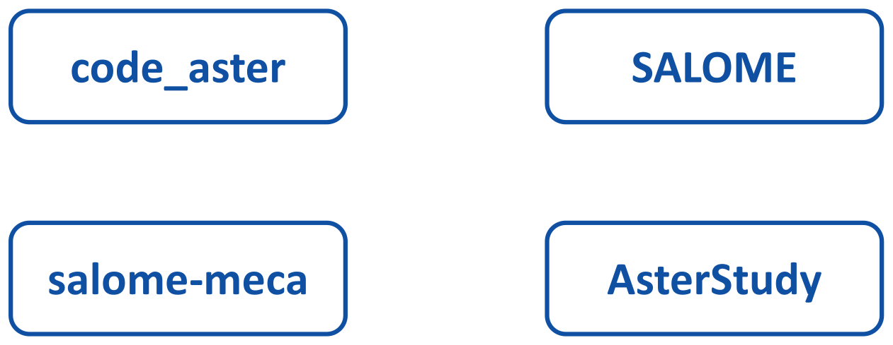
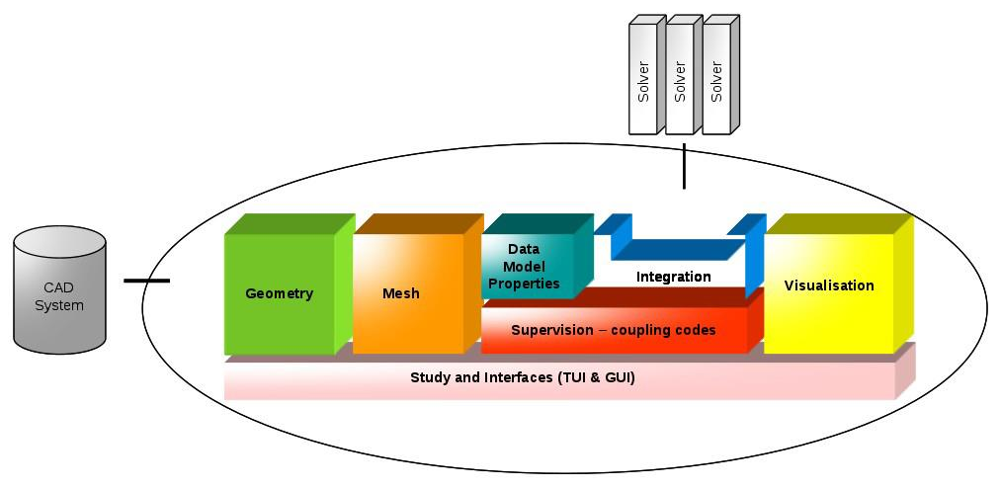
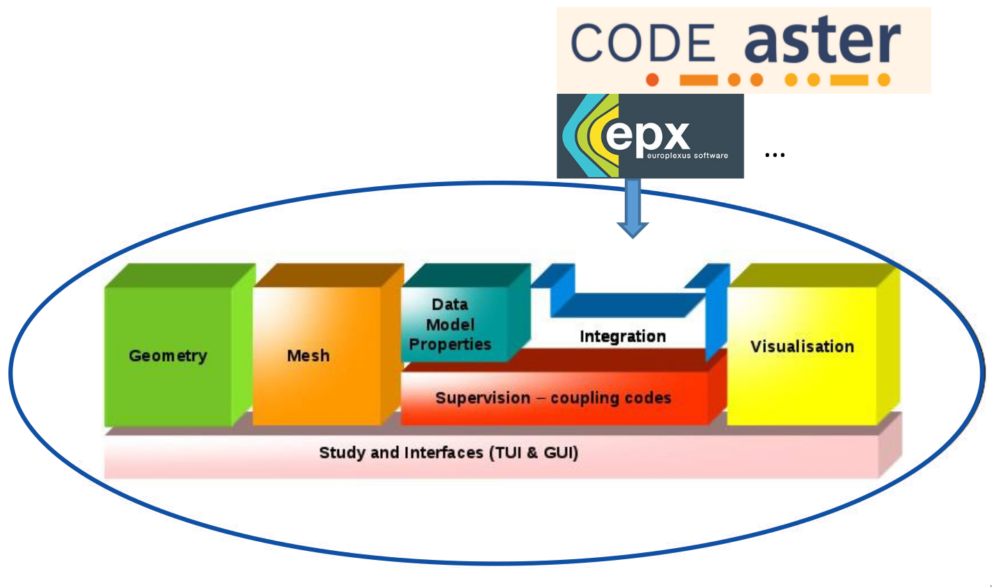
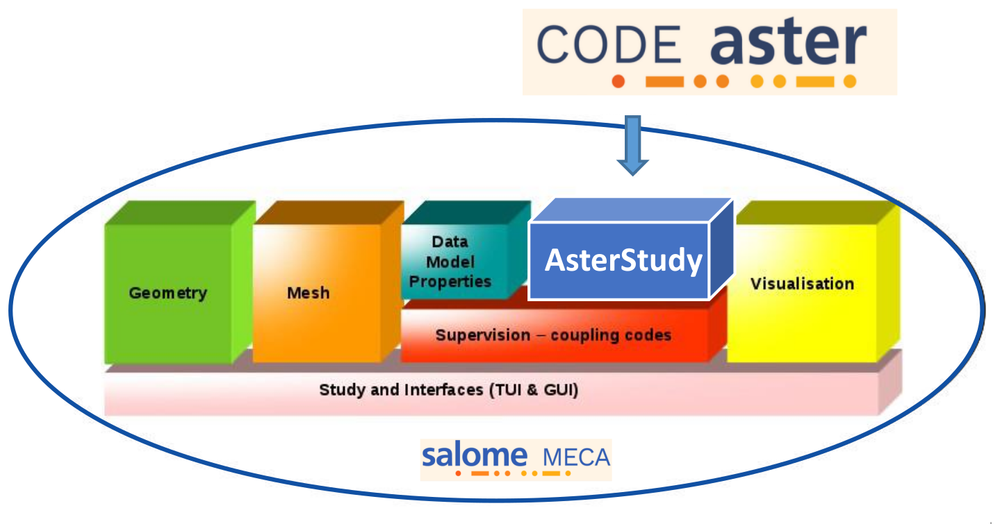
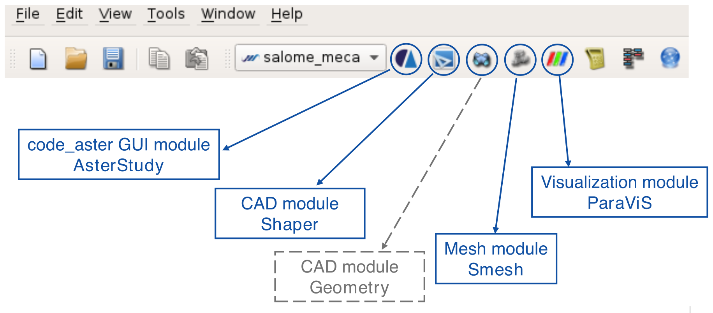
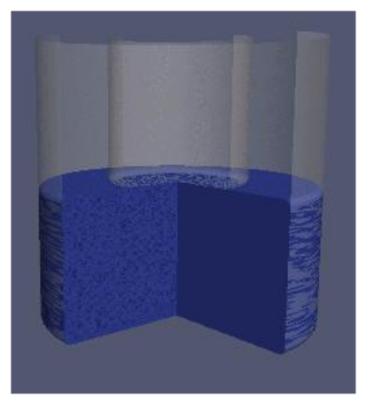
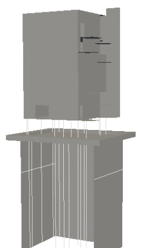
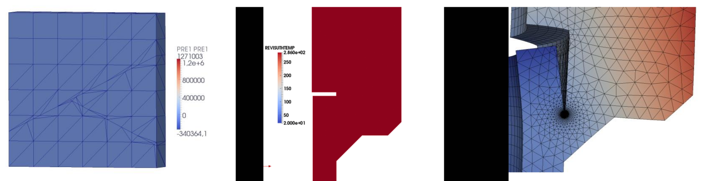
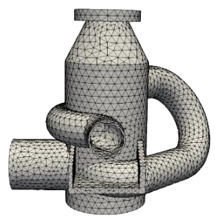
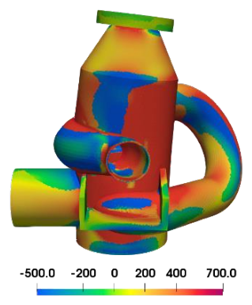

# Presentation of code_aster and salome_meca — Simvia web edition

A Modified Version of **"Presentation of code_aster and salome_meca"**,
*code_aster / salome_meca* course material authored and published by **EDF S.A.**
under the GNU Free Documentation License. The content and the figures are the
original course, unchanged; only the layout is new.

**Authors:** EDF S.A. (the original course material);
[Simvia](https://simvia.tech/fr) (the modifications).

**Publisher of this Modified Version:** Simvia.

Copyright © 2026 Simvia, for the modifications. The original course material
carries no copyright notice.

Permission is granted to copy, distribute and/or modify this document under the
terms of the GNU Free Documentation License, Version 1.3 or any later version
published by the Free Software Foundation; with no Invariant Sections, no
Front-Cover Texts, and no Back-Cover Texts. A copy of the license is included in
the section entitled "GNU Free Documentation License".

---

The course runs in three parts, in the order the original deck presents them:

| | Part | What it covers |
|---|---|---|
| 1 | [General principles of code and platform](#part-1--general-principles-of-code-and-platform) | the four concepts — solver, framework, distribution, GUI — and the modules they put on screen |
| 2 | [Generality of code_aster](#part-2--generality-of-code_aster) | what the code covers: elements, behaviours, solvers |
| 3 | [General information for computation](#part-3--general-information-for-computation) | the five steps of a study, standalone and in salome_meca |

---

## Part 1 · General principles of code and platform

> **In this part**
> [Four different concepts](#four-different-concepts) ·
> [code_aster](#code_aster) ·
> [SALOME](#salome) ·
> [salome_meca](#salome_meca) ·
> [AsterStudy](#asterstudy) ·
> [modules in salome_meca](#modules-in-salome_meca)
>
> *Original deck: slides 4–11.*

### Four different concepts

  
   
  <em>Slides 4 and 10 — the four concepts the part goes through, one by one.</em>

#### code_aster

A « stand-alone » thermo-mechanical solver

  
   
  <em>Slide 5 — the solver takes a mesh and a text file in, and returns physical
  fields.</em>

- Input: mesh, data setting prepared in a text file
- Output: physical fields (displacement, strain, stress, temperature …)

#### SALOME

A generic framework for pre- and post-processing

  
   
  <em>Slide 6 — the framework, with solvers plugged in from outside.</em>

#### salome_meca

Integration of code_aster in SALOME

  
   
  <em>Slide 7 — the solvers plug into the framework.</em>

- Easy installation of a complete environment (linux only)
- A consistent and continuous user experience
  - Access from different modules to main SALOME study elements: meshes, results
  - Graphical selection of topological entities for data setting of code_aster
- Possibility of using different pre- and post-processing tools
  - Importation of meshes and geometries prepared by Geometry and Mesh modules of
    SALOME
  - Importation of different input mesh formats and output result formats
- Possibility for a "stand-alone" use of code_aster solver

#### AsterStudy

Module for Computer Aided Engineering (CAE)

  
   
  <em>Slide 9 — AsterStudy is the code_aster module inside salome_meca.</em>

### modules in salome_meca

  
   
  <em>Slide 11 — where each module sits in the toolbar.</em>

[▲ back to the three parts](#presentation-of-code_aster-and-salome_meca--simvia-web-edition)

---

## Part 2 · Generality of code_aster

> **In this part**
> [An all-purpose code for thermo-mechanical study of structures](#an-all-purpose-code-for-thermo-mechanical-study-of-structures) ·
> [A wide variety of models](#a-wide-variety-of-models) ·
> [A wide variety of behaviours](#a-wide-variety-of-behaviours) ·
> [A wide variety of solvers](#a-wide-variety-of-solvers) ·
> [For advanced simulations](#for-advanced-simulations)
>
> *Original deck: slides 13–17.*

### An all-purpose code for thermo-mechanical study of structures

- Open-source code
- Used by engineers, experts and researchers
  - Studies: a need of a robust, reliable, tested and qualified mechanical
    simulation software at EDF
  - Researches: continuous integration of new models in the development version
- With a wide variety of models
  - &gt; 400 finite elements
  - &gt; 200 constitutive laws
  - A wide range of solvers

  
  
   
  <em>Slide 13 — two of the studies the code is used for.</em>

### A wide variety of models

- Finite elements
  - Continuum mechanics
    - 3D: Linear, quadratic, reduced or full integration, incompressible,
      `COQUE_SOLIDE`
    - 2D: plane strain, plane stress, axi-symmetry, Integration of non-linear
      behaviour in plane stress, incompressible
  - Structural elements
    - 2D elements : shells, plates
    - 1D elements : beams, bars, cables, pipes
    - Discrete elements : masses, springs, dashpots
  - Connections and assemblies
    - Linear relationships between degrees of freedom, transmission of torque
  - Discontinuous media (cracks and joints)
    - XFEM level-sets
    - Joint elements and CZM (Cohesive Zone Model)

### A wide variety of behaviours

- Available Constitutive laws
  - Elasticity and elasto-plasticity
    `ELAS`, `ELAS_HYPER`, `VMIS_ISOT_TRAC`, `VMIS_ISOT_PUIS`, `VMIS_ISOT_LINE`,
    `VMIS_CINE_LINE`, …
  - Elasto-viscoplasticity
    `VISC_ISOT_LINE`, `VISC_ISOT_TRAC`, `LEMAITRE`, `DIS_VISC`,
    `VISC_CIN1_CHAB`, `VISC_CIN2_CHAB`, …
  - Fracture mechanics and damage models
    `ENDO_FRAGILE`, `GTN`, `ROUSSELIER`, `ROUSS_PR`, `ROUSS_VISC`, `VENDOCHAB`,
    `VISC_ENDO_LEMA`, …
  - Concrete, reinforced concrete, civil engineering models
    `ENDO_ISOT_BETON`, `ENDO_SCALAIRE`, `ENDO_CARRE`, `ENDO_ORTH_BETON`,
    `MAZARS`, …
  - Geomaterials: `ELAS_GONF`, `CJS`, `LAIGLE`, `LETK`, `HOEK_BROWN`,
    `HOEK_BROWN_EFF`, …
  - Materials for nuclear fuel and metals under irradiation
    `VISC_IRRA_LOG`, `GRAN_IRRA_LOG`, `GATT_MONERIE`, `LEMAITRE_IRRA`,
    `LMARC_IRRA`, …
  - Models with mechanical effects of metallurgical transformations
  - Multi-physics: thermo-hydro-mechanical, concrete, metallurgy
- User materials : UMAT, MFront, Aster

### A wide variety of solvers

- Algorithms and analysis methods
  - Mechanical solvers
    - Linear or non-linear statics : `MECA_STATIQUE`, `STAT_NON_LINE`
    - Dynamics on physical basis : `DYNA_VIBRA`, `DYNA_NON_LINE`
    - Modal analysis : `CALC_MODES`
    - Dynamic on modal basis : `DYNA_VIBRA`
  - Other physics
    - Thermics : `THER_LINEAIRE`, `THER_NON_LINE`
    - Acoustics : `PHENOMENE='ACOUSTIQUE'`
    - Metallurgy (for welding applications)
    - FSI : fluid-structure interaction
    - Thermo-hydro-mechanical coupling (porous media modelling)

### For advanced simulations

- Solving three types of non-linear problems
  - Material behaviour: around two hundred nonlinear constitutive laws
  - Kinematics: large displacements, large strains, large rotations
  - Contact and/or friction
- Advanced features in mechanics
  - Porous media, fracture mechanics, fatigue, damage, metallurgy, seismic
    analysis, rotating systems ...

  
   
  <em>Slide 17 — porous media, metallurgy and fracture mechanics.</em>

[▲ back to the three parts](#presentation-of-code_aster-and-salome_meca--simvia-web-edition)

---

## Part 3 · General information for computation

> **In this part**
> [Numerical simulation](#numerical-simulation)
>
> *Original deck: slide 19.*

### Numerical simulation

| Step | code_aster standalone | salome-meca |
|---|---|---|
| 1. Geometry definition | CAD modeller | Shaper / GEOM |
| 2. Mesh generation | Mesh tool | SMESH |
| 3. Data settings | Text editor | AsterStudy |
| 4. Launching and survey (Input / output files) | Outil ASTK | AsterStudy |
| 5. Result analysis | Visualization application, spreadsheet … | AsterStudy / ParaViS |

  
  
   
  <em>Slide 19 — the geometry and the result, at the two ends of the five
  steps.</em>

[▲ back to the three parts](#presentation-of-code_aster-and-salome_meca--simvia-web-edition)

---

Is something missing or unclear in this document?
Or feeling happy to have read such a clear tutorial?

Please, we welcome any feedbacks about *Code_Aster* training materials.
Do not hesitate to share with us your comments on the
[*Code_Aster* forum](https://forum.code-aster.org/).

---

## History

- **Presentation of code_aster and salome_meca** — *code_aster / salome_meca*
  course material, authored and published by EDF S.A. under the GNU Free
  Documentation License, distributed as a slide deck. Its Title Page states no
  year.
- **Presentation of code_aster and salome_meca — Simvia web edition**, 2026,
  modified and published by Simvia. Converted from the slide deck into a web
  page: text and figures unchanged, layout new.
  <https://simvia-tech.github.io/tutorials-code_aster/>

## GNU Free Documentation License

The full text of the license is in [LICENSE](../../LICENSE) at the root of this
repository.
