# CAO et maillage dans salome_meca : SHAPER & SMESH — Simvia web edition

A Modified Version of **"CAO et maillage dans salome_meca : SHAPER & SMESH"**,
*code_aster / salome_meca* course material authored and published by **EDF S.A.**
under the GNU Free Documentation License. The content and the figures are the
original course, unchanged; only the layout is new.

**Authors:** EDF S.A. — Gérald NICOLAS, Soizic PERON, EDF R&D PERICLES (the
original course material); [Simvia](https://simvia.tech/fr) (the modifications).

**Publisher of this Modified Version:** Simvia.

The original course material carries the notice `Copyright 2021 EDF`, preserved
here as the license requires. Copyright © 2026 Simvia, for the modifications.

Permission is granted to copy, distribute and/or modify this document under the
terms of the GNU Free Documentation License, Version 1.3 or any later version
published by the Free Software Foundation; with no Invariant Sections, no
Front-Cover Texts, and no Back-Cover Texts. A copy of the license is included in
the section entitled "GNU Free Documentation License".

---

The course runs in five parts, in the order the original deck presents them:

| | Part | What it covers |
|---|---|---|
| 1 | [Comment faire un maillage ?](#part-1--comment-faire-un-maillage-) | the three steps, and the module that carries out each one |
| 2 | [SHAPER](#part-2--shaper) | the CAD module: principles, conformity, reuse, tests, documentation |
| 3 | [SMESH](#part-3--smesh) | the meshing module: what it does, what it needs, which mesher runs |
| 4 | [Exercice n°1](#part-4--exercice-n1) | a quarter of a perforated plate, meshed in quadratic triangles |
| 5 | [Exercice n°2](#part-5--exercice-n2) | an elbowed pipe, meshed in linear hexahedra |

---

## Part 1 · Comment faire un maillage ?

> **In this part**
>
> *Original deck: slide 2.*

- Créer la CAO du domaine de calcul avec le module SHAPER
- La transférer au module SMESH
- Appliquer les différents algorithmes possibles en 1D, 2D, 3D

  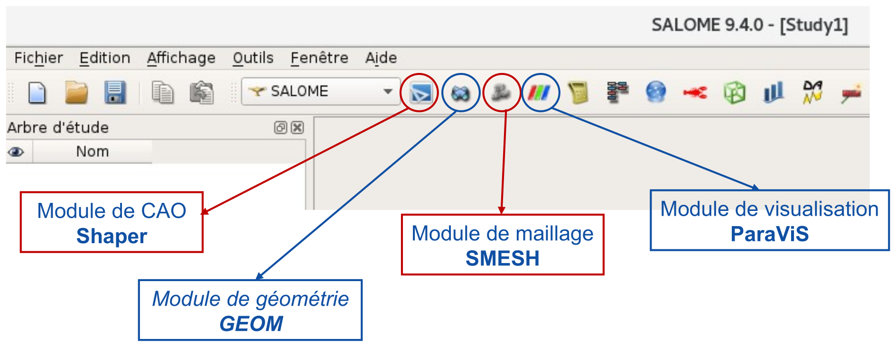
   
  <em>Slide 2 — the four modules the course moves between, in the toolbar.</em>

[▲ back to the five parts](#cao-et-maillage-dans-salome_meca--shaper--smesh--simvia-web-edition)

---

## Part 2 · SHAPER

> **In this part**
> [Les grands principes](#les-grands-principes) ·
> [Une CAO pour la simulation numérique](#une-cao-pour-la-simulation-numrique) ·
> [Redessiner une CAO existante](#redessiner-une-cao-existante) ·
> [Modifier une CAO existante](#modifier-une-cao-existante) ·
> [Les tests](#les-tests) ·
> [Documentation](#documentation)
>
> *Original deck: slides 3–8.*

### Les grands principes

- Paramétrique et variationnel
  - Assemblage de pièces en 3D
- Dessin à l'IHM privilégié, ce qui n'empêche pas le scripting python
- Dédié à la CAO pour la simulation numérique

**Variationnel :**

1. Dessin interactif sur des esquisses 2D :
   - Similaire aux pratiques de dessin industriel
   - Application de contraintes : parallélisme, distance, coïncidence…

**Paramétrique :**

2. Mise en volume :
   - par extrusion, révolution, balayage
   - puis opérations booléennes…
   - Chaque paramètre peut être édité et modifié
   - La forme est automatiquement mise à jour

  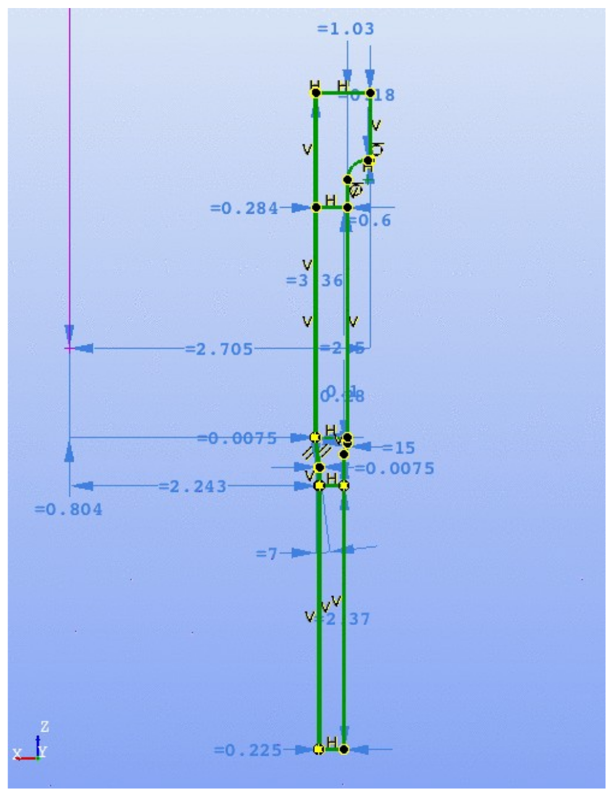
   
  <em>Slide 3 — a fully constrained sketch, every dimension a parameter.</em>

### Une CAO pour la simulation numérique

- Groupes
  - points, arêtes, faces, solides
- Conformité des formes :
  - géométrie non manifold (ex : arête partagée par plus de 2 faces)
  - partitionnement
  - multi-dimensionnel connecté
  - géométrie maillable « conforme »
- Scripting python

  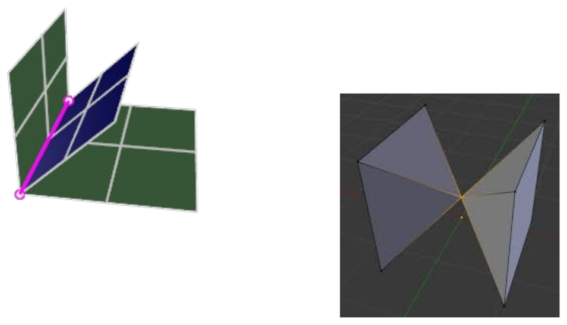
   
  <em>Slide 4 — non manifold geometry: an edge shared by more than two faces.</em>

  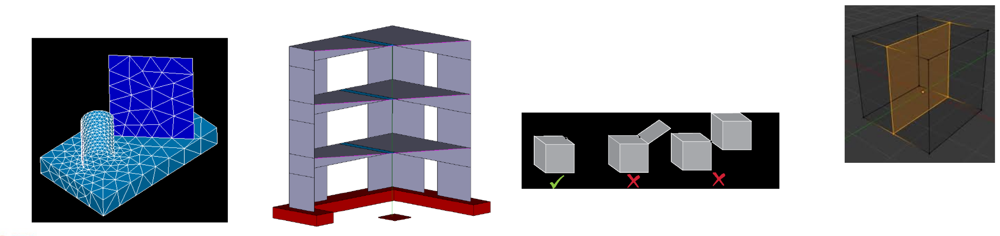
   
  <em>Slide 4 — partitioning, connected multi-dimensional shapes, and what makes
  a geometry conformally meshable.</em>

### Redessiner une CAO existante

- Copier/adapter le script python
- Ou re-dessiner :
  - Relever les cotes
  - Macro « sketch drawer » → projection des contours d'une face plane
  - Macro « import de points 3D »

  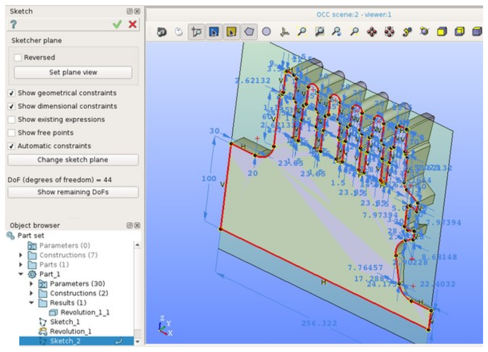
  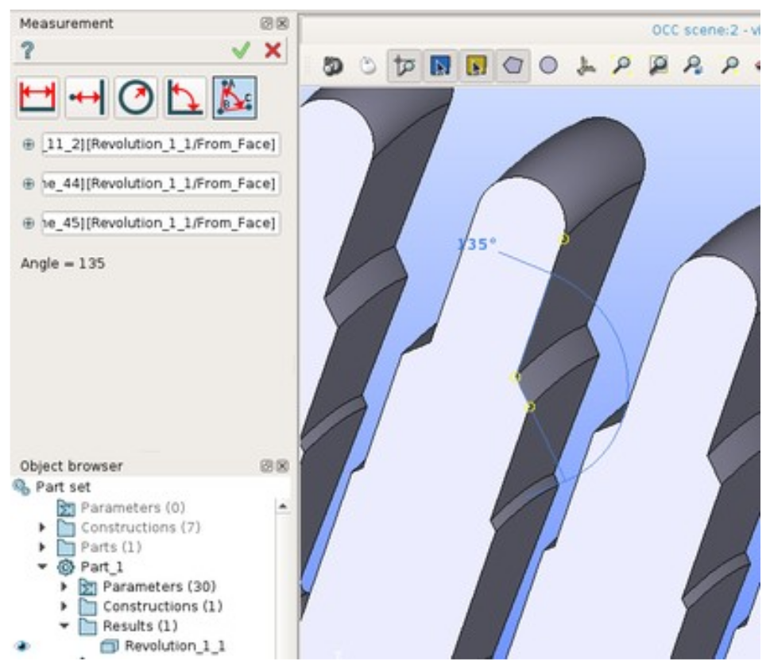
   
  <em>Slide 5 — projecting the contour of a plane face, and reading a dimension
  off an existing model.</em>

### Modifier une CAO existante

- Exemple sur l'attache d'ailette ci-dessous :
  - Import de modèle GEOM dans SHAPER (formats BREP, XAO).
  - Ajouts/modifications possibles :
    - enlèvement de matière
    - translation, rotation, symétrie, mise à l'échelle, copie (linéaire, circulaire)

  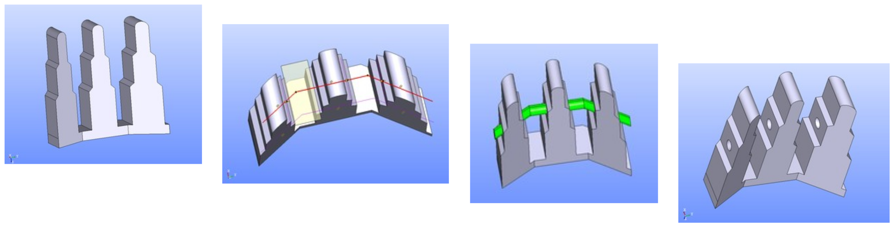
   
  <em>Slide 6 — material removed, then the part translated, rotated, mirrored,
  scaled and copied.</em>

### Les tests

- Plus de 1000 modèles de tests généraux
- Quelques dizaines de modèles EDF réels :

  
   
  <em>Slide 7 — a few dozen of the real EDF models used as tests.</em>

### Documentation

- Le mode d'emploi est consultable pour chaque fonction.
- Des exemples de programmation python sont téléchargeables.
- Recherche possible.

  
   
  <em>Slide 8 — the manual for every function, with downloadable python
  examples and a search box.</em>

[▲ back to the five parts](#cao-et-maillage-dans-salome_meca--shaper--smesh--simvia-web-edition)

---

## Part 3 · SMESH

> **In this part**
> [Objectif du module](#objectif-du-module) ·
> [Fonctionnement du module](#fonctionnement-du-module)
>
> *Original deck: slides 9–13.*

### Objectif du module

- Le module SMESH :
  - Permet de mailler un domaine 1D, 2D ou 3D
  - Traduit les groupes définis dans la CAO en groupes de mailles et de nœuds
    pour le calcul
  - Gère des manipulations sur des maillages existant (symétrie, translation, etc.)
  - Propose des fonctions de contrôle de maillage
  - Contient des utilitaires spécifiques (couches limites, fissure…)

  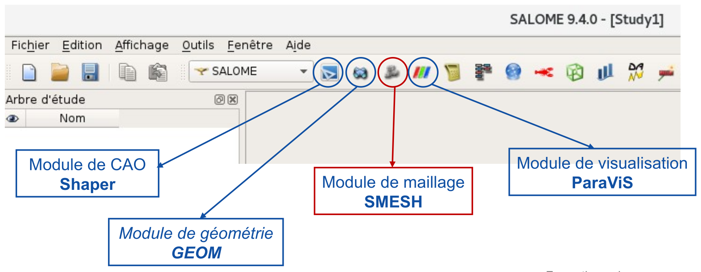
   
  <em>Slide 9 — SMESH, the meshing module, picked out in red.</em>

### Fonctionnement du module

#### Un point de départ et des directives

- Un point de départ :
  - Une géométrie au format SALOME
  - Créée par GEOM ou SHAPER
- Des directives :
  - Choix d'un algorithme
  - Définition d'hypothèses
- IHM ou python

  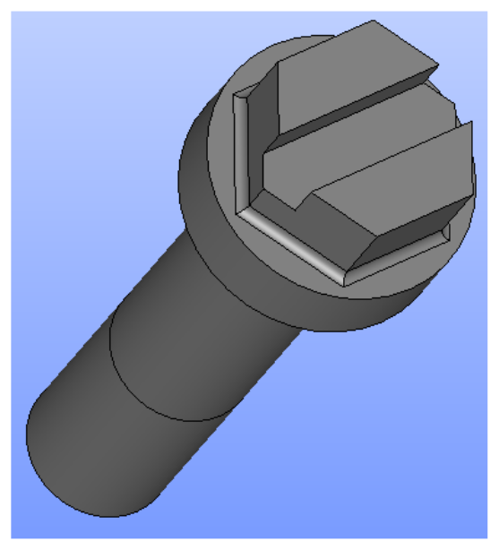
  
   
  <em>Slide 10 — a SALOME geometry and its groups go in, and a mesh object comes
  out to be qualified.</em>

#### Des fonctions de visualisation

  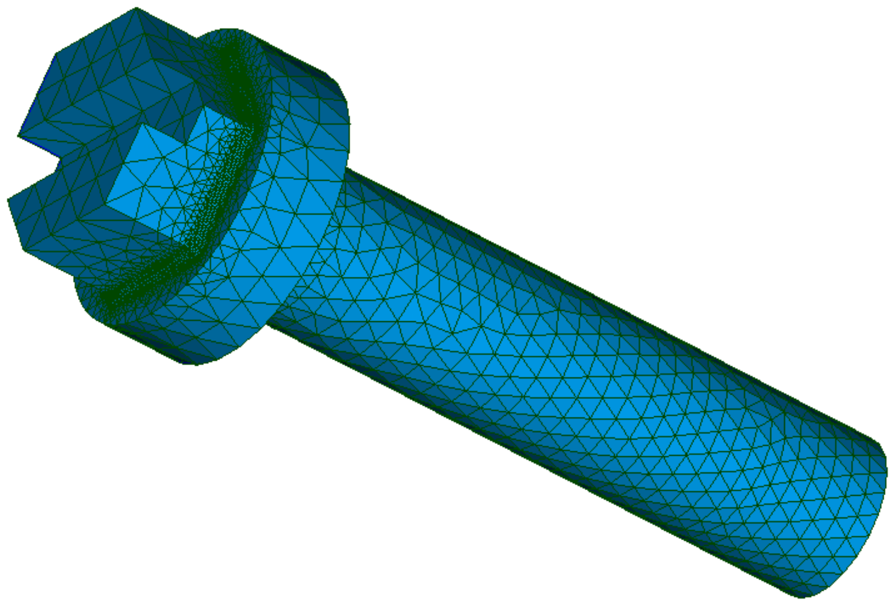
   
  <em>Slide 11 — the computed mesh, displayed in the viewer.</em>

#### Deux types de mailleurs

- Schématiquement, SMESH propose deux types de mailleurs :
  - Des logiciels externes pour les principales fonctions ; il sont intégrés dans
    SALOME par EDF et le CEA.
  - Des compléments internes à SALOME pour des fonctions spécifiques : extrusion,
    couches limites, fissure, etc.
- Logiciel externe sous licence : MeshGems
  - La suite MeshGems est issue de travaux de l'INRIA.
  - Elle est distribuée par la société Dassault Systèmes :
    [www.spatial.com/products/3d-precise-mesh](https://www.spatial.com/products/3d-precise-mesh)
  - Triangles, quadrangles libres, tétraèdres.
  - Hexaèdre libre sous forme de prototype.
  - *Remarque : accessible sans frais à tout utilisateur EDF.*
- Logiciel externe libre : NETGEN
  - La suite NETGEN : [ngsolve.org](https://ngsolve.org)
  - Triangles, quadrangles libres, tétraèdres

#### Commentaires

- Commentaires
  - La suite MeshGems est recommandée pour tous les maillages en triangles et
    tétraèdres. La plupart du temps, les mailles obtenues sont de meilleure qualité.
  - De nombreuses options existent pour affiner le maillage.
- Maillage en hexaèdre
  - Le maillage automatique en hexaèdre est disponible à titre expérimental.
  - C'est un sujet de recherche dans la communauté internationale du maillage.
  - Le maillage en hexaèdre reste donc toujours une opération difficile.
- Documentation
  - La documentation est accessible par le menu général d'aide.

  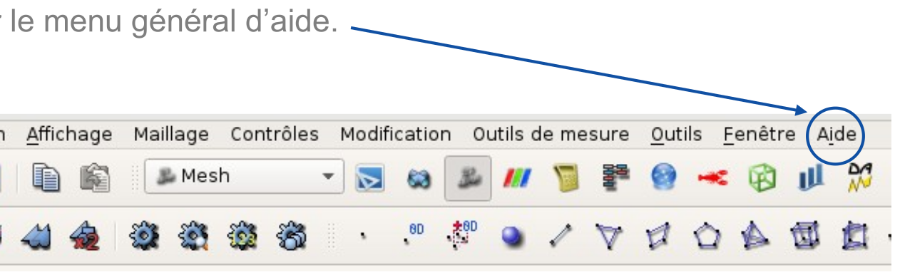
   
  <em>Slide 13 — the documentation is reached from the general help menu.</em>

[▲ back to the five parts](#cao-et-maillage-dans-salome_meca--shaper--smesh--simvia-web-edition)

---

## Part 4 · Exercice n°1

> **In this part**
> [Objectif](#objectif) ·
> [Données](#donnes) ·
> [L'esquisse de la plaque](#lesquisse-de-la-plaque) ·
> [Les contraintes](#les-contraintes) ·
> [La face et les groupes](#la-face-et-les-groupes) ·
> [Le maillage : algorithme et hypothèses](#le-maillage--algorithme-et-hypothses) ·
> [Calcul et exportation](#calcul-et-exportation)
>
> *Original deck: slides 14–42.*

### Objectif

- Un quart de plaque trouée
- Objectif :
  - Maillage en triangles
  - Plus fin au bord du trou
  - Quadratique

  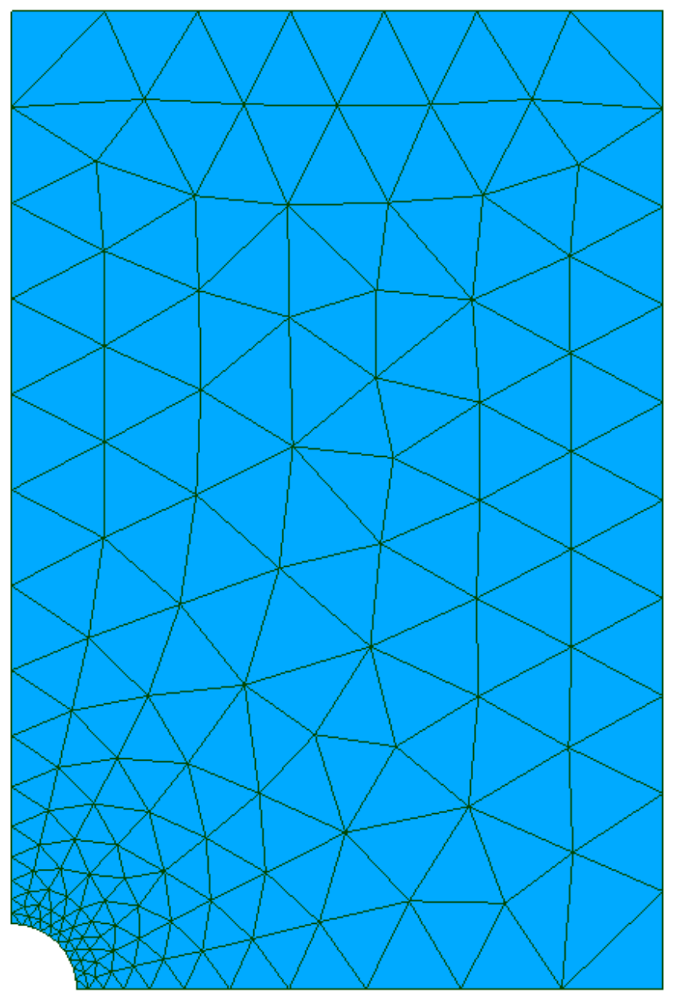
   
  <em>Slide 14 — the mesh the exercise builds: triangles, refined at the edge of
  the hole.</em>

### Données

- Groupes d'arêtes sur les bords :
  - `gauche`, `haut`, `droite`, `bas`, `arc`
- Groupes de nœuds :
  - `A`, `B`
- Tailles de maille :
  - 15 en général
  - 1,5 sur l'arc

  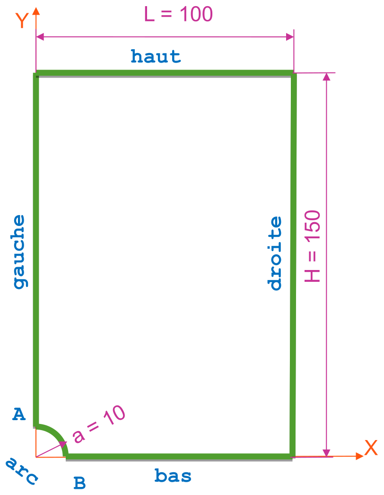
   
  <em>Slide 15 — the dimensions, the edge groups and the two node groups.</em>

### L'esquisse de la plaque

#### Activer le module SHAPER, créer une nouvelle pièce

- Activer le module SHAPER
- Créer une nouvelle pièce (part)
- Elle apparaît dans le browser, avec ces rubriques, vides au démarrage :
  - `Paramètres` : ceux de la future pièce.
  - `Constructions` : les différentes esquisses, plans, axes, etc. nécessaires au
    fur et à mesure.
  - `Résultats` : le ou les dernières parties créées pour constituer la pièce.
    Cette rubrique se remplit et se vide au fur et à mesure des opérations.

  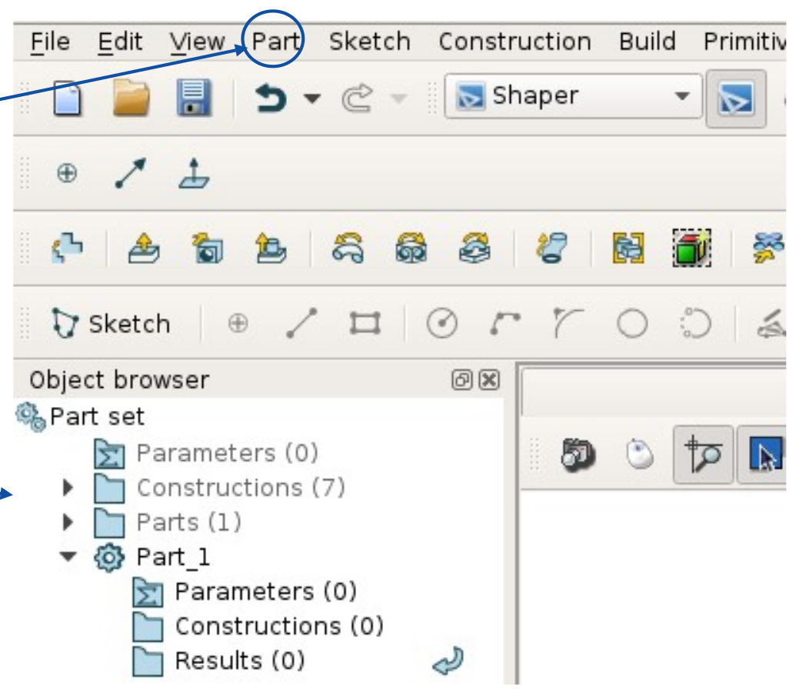
   
  <em>Slide 16 — the new part appears in the browser with its three sections
  still empty.</em>

#### Créer une esquisse

- Créer une esquisse (sketch)
- Choisir successivement :
  - La taille ; c'est une estimation pour cadrer la vue. En gros c'est le côté
    d'un carré qui contient le futur dessin.
    - *Se tromper n'est pas grave mais simplement désagréable car il faudra faire
      des recadrages en visualisation.*
  - Le plan : celui sur lequel on va dessiner. La feuille de papier en quelque
    sorte. On choisit l'un des 3 plans XOY, YOZ ou XOZ, soit en le désignant à la
    souris dans la fenêtre graphique, soit en le sélectionnant dans la liste du
    browser. Pour cet exercice, on choisit XOY.
  - On valide.
- *Remarque :*
  - *Pour des CAO 3D compliquées, on pourra choisir un plan qui est une face de
    l'objet en cours de création ou un plan que l'on aura créé spécialement. Cela
    permet de positionner l'esquisse que l'on dessine directement à sa place dans
    l'espace 3D*

  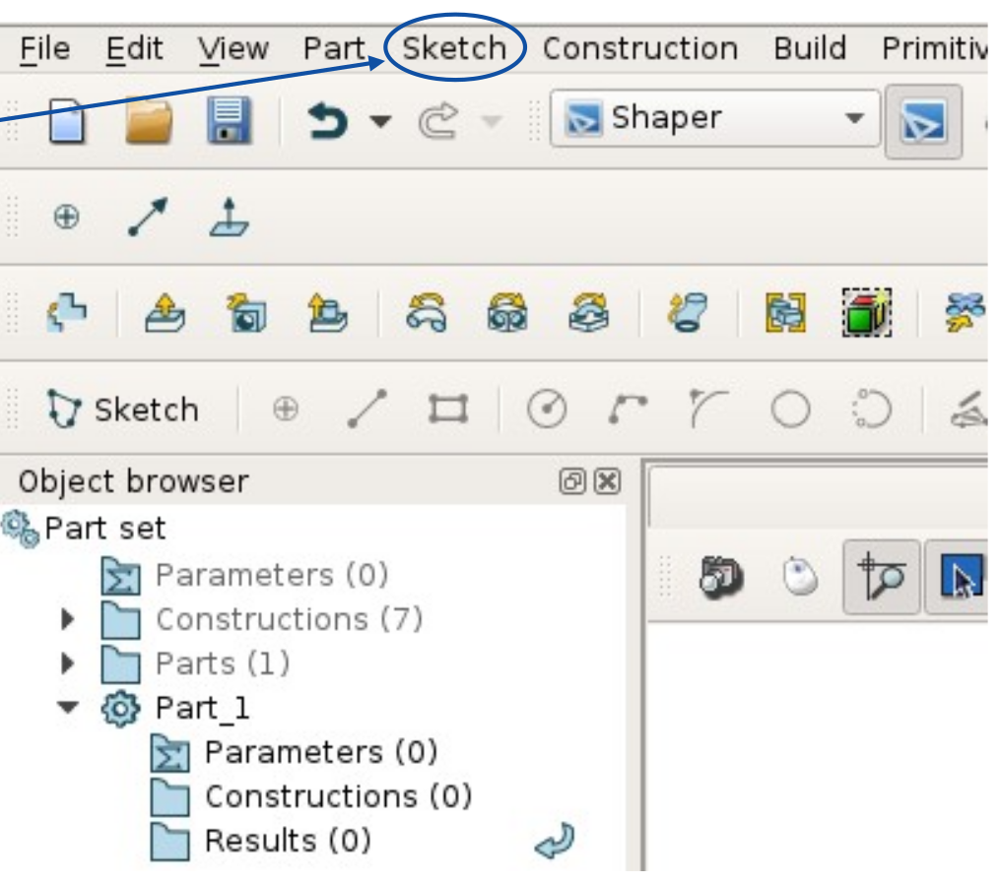
  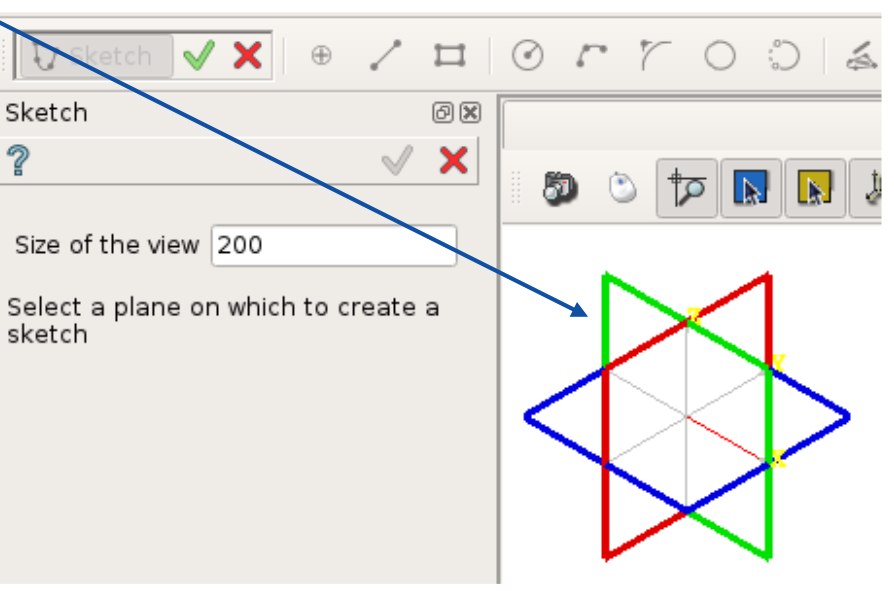
   
  <em>Slide 17 — the size of the view, then the plane the sketch is drawn on.</em>

#### Dessiner à main levée les contours rectilignes

- Dessiner à main levée les contours rectilignes
  - Respecter *grosso modo* les formes et les dimensions.
  - Se placer du bon côté des axes.
  - Pour arrêter : touche `"Echap"`
- Inutile de se forcer à être exact :
  - Les dimensions réelles seront appliquées plus tard.
  - On peut bouger ou déformer le dessin après coup pour l'ajuster, par exemple
    pour se positionner du bon côté des axes.
- Bilan
  - Il y a 10 degrés de liberté : 5 sommets x 2 coordonnées

  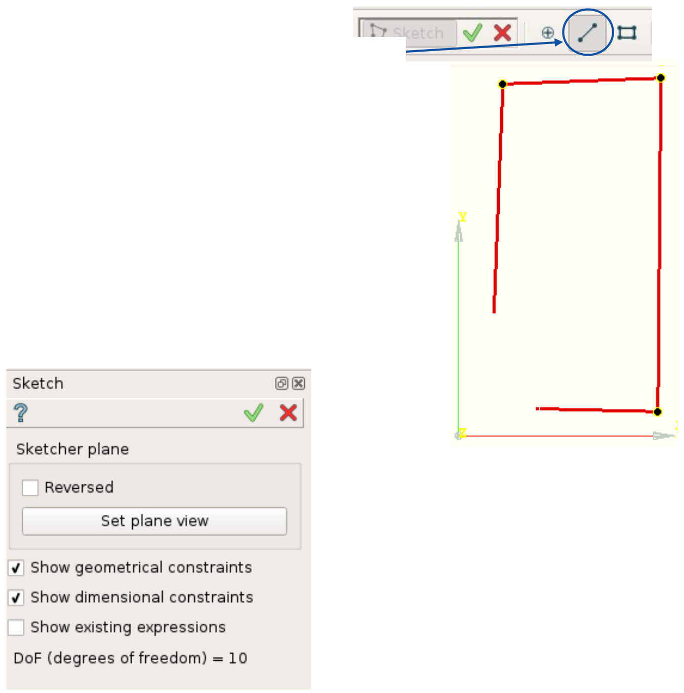
   
  <em>Slide 18 — the straight contours drawn freehand, ten degrees of freedom
  left.</em>

#### Les pièges, ou les astuces

- Les pièges (ou les astuces…)
  - Si on trace un trait « presque » verticalement, SHAPER le contraint à l'être.
  - Evidemment même chose horizontalement !
- Bilan
  - Si on laisse SHAPER fixer verticales et horizontales, il n'y a plus que
    6 degrés de liberté :
    - 2 sommets au sud-ouest x 2 coordonnées
    - Le sommet au nord-est x 2 coordonnées
  - Cela peut s'avérer très pratique. Mais cela ne correspond pas toujours à ce
    qu'on cherche au final, par exemple si on veut paramétrer l'angle de la ligne
    avec un axe.
  - On peut donc inactiver cette fonction.

  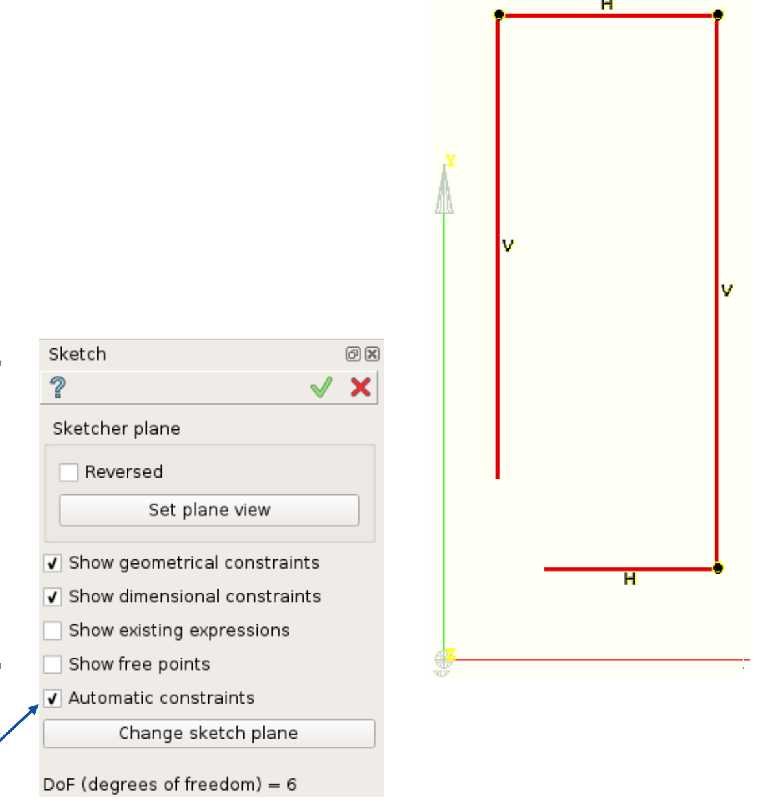
   
  <em>Slide 19 — SHAPER has fixed the verticals and horizontals by itself, and
  the count drops to six.</em>

#### Un autre piège

- Un autre piège (ou une autre astuce…)
  - Si on est observateur ;=) on remarque que la figure finale est un rectangle
    avec un coin cassé.
  - On a la tentation de le dessiner ainsi
  - Alors il n'y a plus que 4 degrés de liberté :
    - Le sommet au sud-ouest x 2 coordonnées
    - Le sommet au nord-est x 2 coordonnées
- Problème :
  - Le sommet au sud-ouest est verrouillé.
  - On peut le débloquer mais l'opération est plus longue que d'avoir dessiné en
    tenant compte de l'ouverture dès le début.

  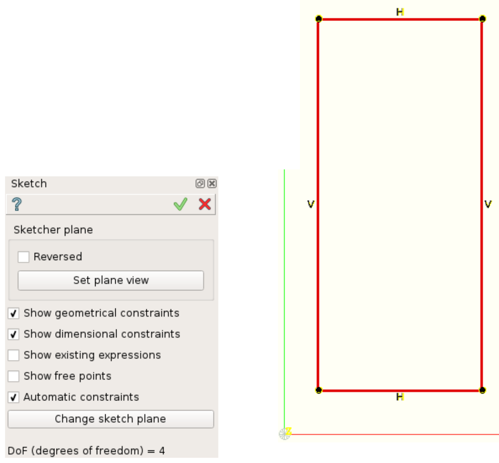
   
  <em>Slide 20 — drawn as a plain rectangle, only four degrees of freedom remain,
  but the south-west vertex is locked.</em>

#### Insérer l'arc de cercle

- Insérer l'arc de cercle, grosso modo
  - On pique le centre (clic gauche), puis la 1ère extrémité, puis la seconde,
    à peu près où ils doivent être.
  - Le sens est horaire.
  - Se placer du bon côté des axes.
- Cela ajoute 5 degrés de liberté :
  - 2 extrémités x 2 coordonnées
  - Le rayon

  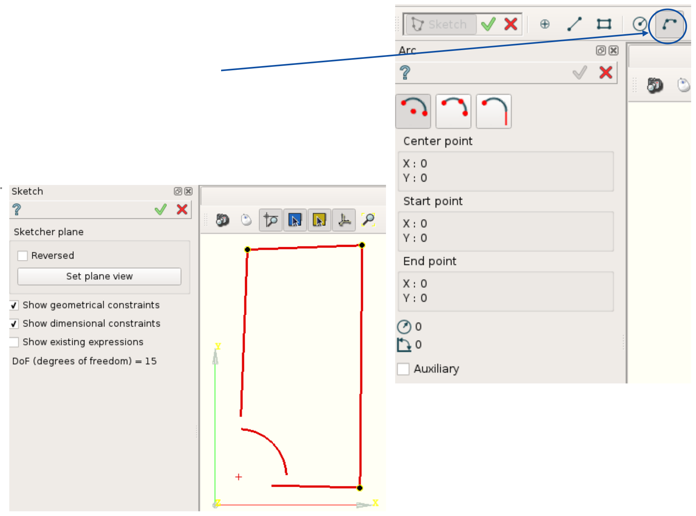
   
  <em>Slide 21 — the arc picked centre first, then its two ends, clockwise.</em>

### Les contraintes

#### La palette de contraintes

- Les contraintes
  - Pour figer l'esquisse, SHAPER propose une palette d'actions :
  - Distance entre un point et un autre point ou une ligne
  - Distance horizontale/verticale entre un point et un autre point ou une ligne
  - Longueur
  - Angle entre deux lignes
  - Rayon
  - Rendre horizontal/vertical
  - Figer tel quel
  - Rendre parallèle/perpendiculaire/tangent
  - Faire coïncider
  - Mettre un point au milieu d'une ligne
  - Attribuer la même longueur
  - Rendre colinéaire

  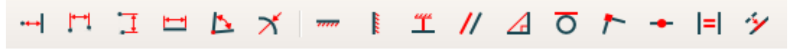
   
  <em>Slide 22 — the palette of constraints available to fix the sketch.</em>

#### Degrés de liberté en théorie et en pratique

- On peut comprendre théoriquement qu'il existe des degrés de liberté sous une
  forme et dans la pratique les annihiler sous une autre forme.
- Exemple :
  - Une ligne isolée a 4 degrés de liberté qui sont les coordonnées de ses
    extrémités.
    - En imposant à la ligne d'être horizontale, il n'y a plus que 3 ddl.
    - En imposant à la 1ère extrémité d'être confondue avec l'origine du repère,
      il n'y a plus qu'un seul ddl.
    - En imposant une longueur à cette ligne, il n'y a plus aucun degré de liberté.
  - → On aura ainsi figé la ligne sans jamais donner les valeurs des coordonnées
    des extrémités.

  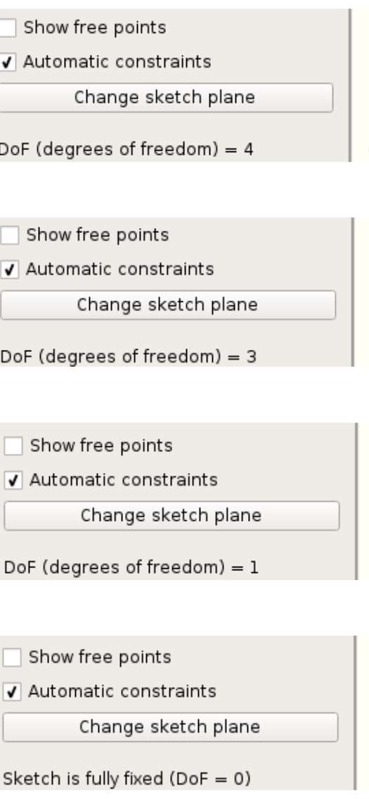
   
  <em>Slide 23 — four degrees of freedom removed one constraint at a time, the
  coordinates never given.</em>

#### Appliquer les contraintes

- Appliquer les contraintes
  - Le centre du cercle est placé sur l'origine du repère (-2 ddl).
  - Les extrémités de l'arc sont au bout des segments (-2 ddl).
  - Les extrémités de l'arc sont sur les axes (-2 ddl).
  - Les 4 segments sont horizontaux ou verticaux (-6 ddl).
- Noter :
  - Les notations H et V sur les segments bloqués.
  - Les symboles de coïncidence.
  - En bougeant le dessin, on visualise ce qui manque.
- Bilan :
  - Il reste 3 degrés de liberté : les dimensions.

  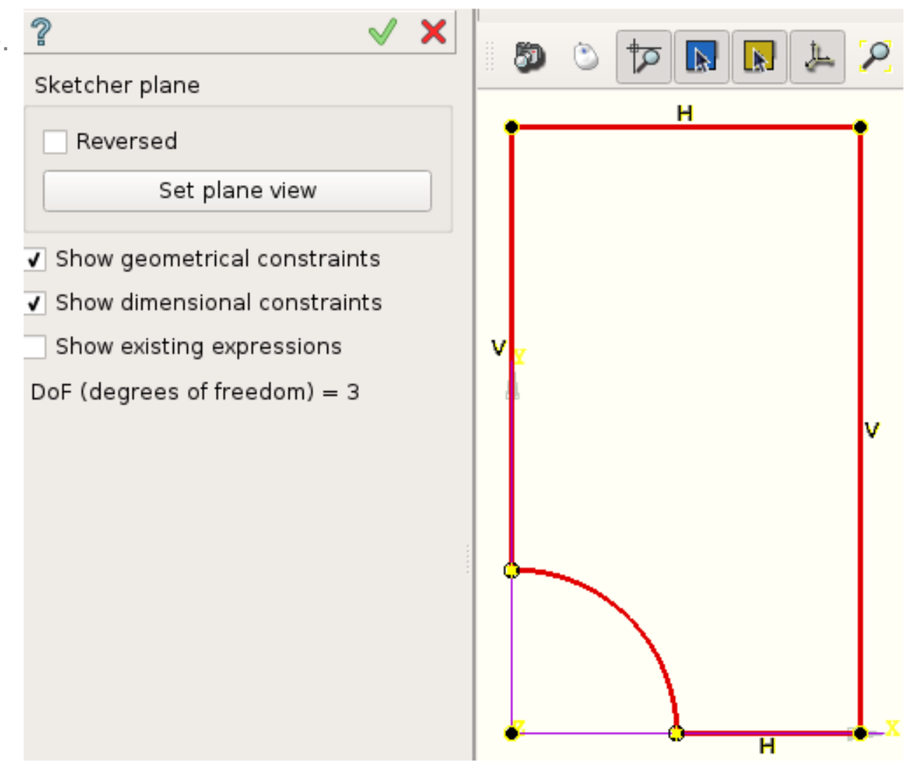
   
  <em>Slide 24 — twelve degrees of freedom removed; the three dimensions
  remain.</em>

#### Les contraintes de dimension

- Les contraintes de dimension
  - La valeur actuelle s'affiche en bleu
  - La valeur voulue peut être définie de 3 façons :
    - Brute : non modifiable ensuite.
    - Avec un paramètre défini auparavant, hors tracé d'esquisse.
    - En définissant un nouveau paramètre avec son nom et sa valeur ; ce paramètre
      sera modifiable et utilisable à nouveau si besoin.

  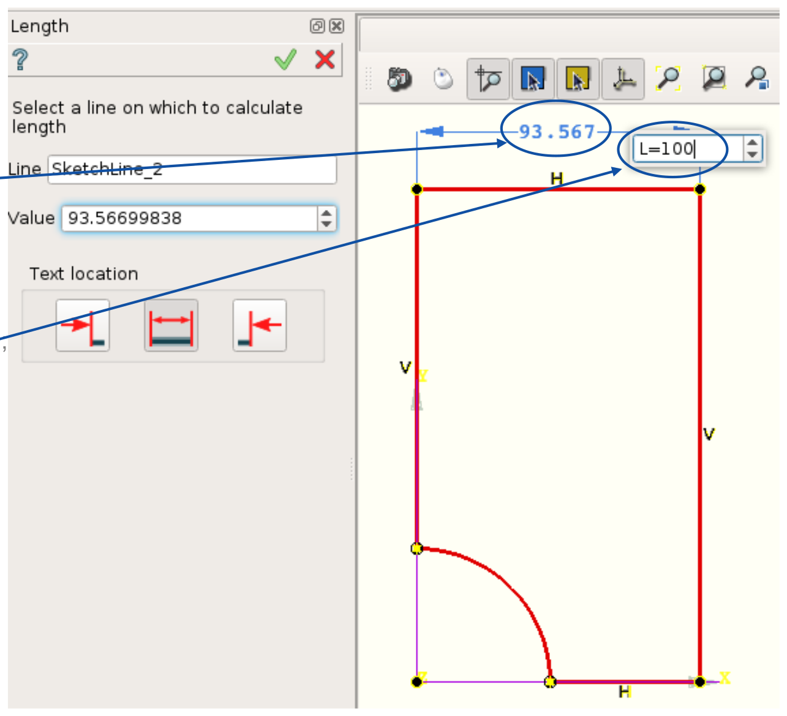
   
  <em>Slide 25 — the current value in blue, and the wanted value entered as a
  new named parameter.</em>

#### Fin des contraintes

- Fin des contraintes :
  - L'esquisse passe au vert (0 degrés de liberté)
  - Affichage des dimensions sous deux aspects :
    - La valeur prescrite.
    - La nom du paramètre, le cas échéant.

  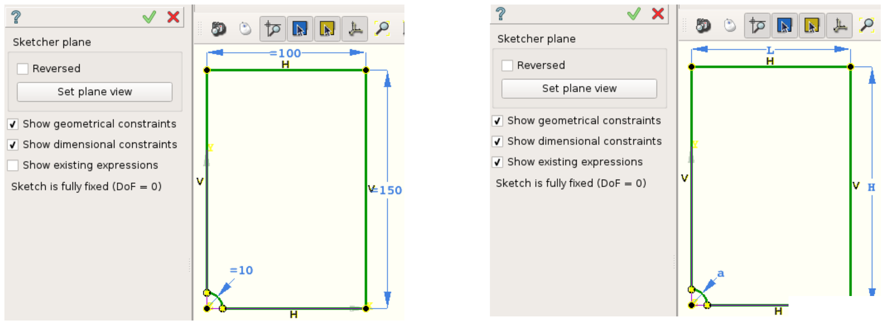
   
  <em>Slide 26 — the sketch turns green, and the dimensions read either as values
  or as parameter names.</em>

#### Dans l'arbre d'études

- Dans l'arbre d'études
  - Dans la zone `Parameters`, on retrouve les paramètres qui ont été créés au
    cours du dimensionnement : nom et valeur. On peut les modifier en partant
    d'ici et le dessin s'ajuste automatiquement.
  - Dans la zone `Construction`, s'inscrit le produit du sketch. C'est d'ici que
    l'on pilote sa visualisation ou son utilisation ultérieure dans l'élaboration
    de la pièce.
  - Dans la zone courante, en bas, ce sont les opérations. C'est d'ici qu'on
    pourra modifier l'esquisse si besoin.

  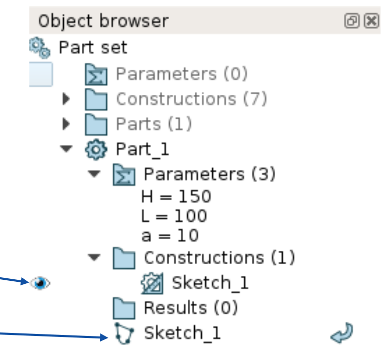
   
  <em>Slide 27 — the parameters, the sketch as a construction, and the operation
  itself.</em>

#### Commentaire sur les contraintes

- Commentaire sur les contraintes
  - A chaque contrainte correspond un symbole dans la partie graphique.
    - Point jaune pour les coïncidences.
    - Lettre H ou V pour horizontalité ou verticalité.
    - Flèches avec les cotes.
    - Etc.
  - On peut supprimer une contrainte en détruisant ce symbole.
  - On peut affecter les contraintes à n'importe quelle étape de l'élaboration de
    l'esquisse. Il est conseillé de les appliquer au fur et à mesure pour
    optimiser le traitement.

  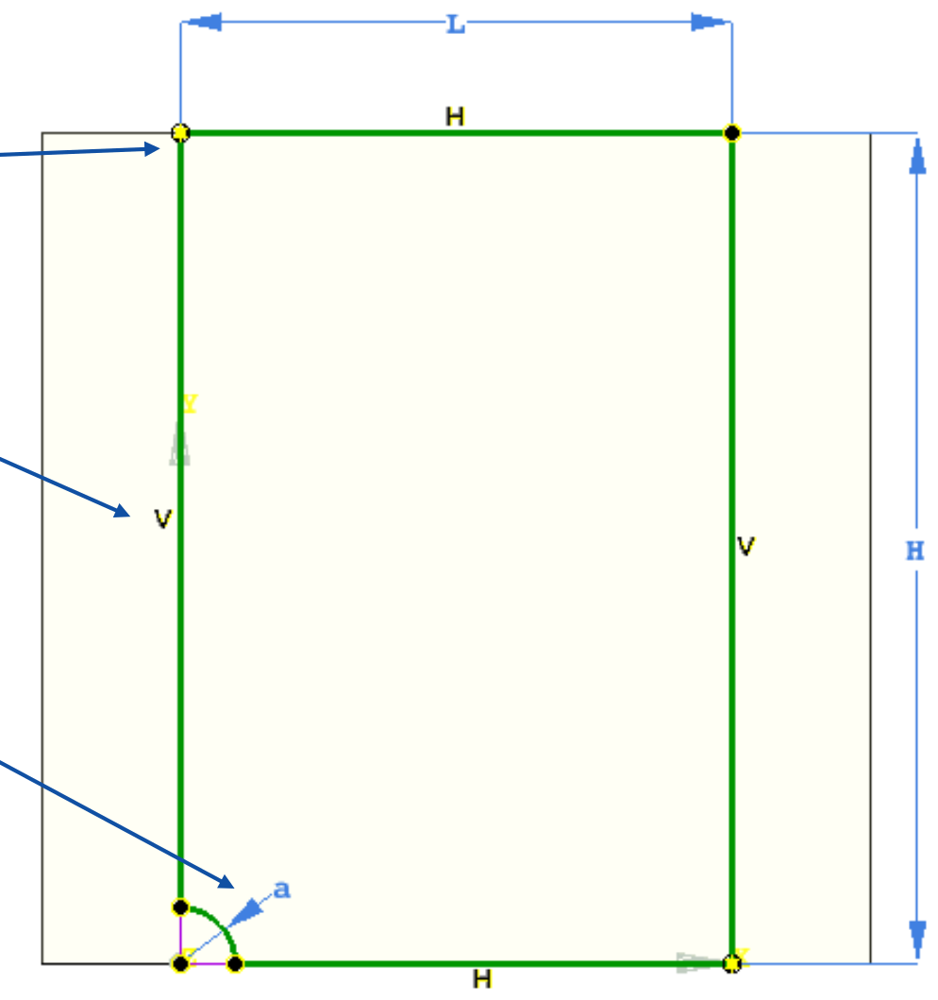
   
  <em>Slide 28 — every constraint has its symbol in the graphics area, and can be
  deleted through it.</em>

### La face et les groupes

#### Création de la face

- Création de la face
  - Menu `"Build/Face"` avec la construction issue de l'esquisse.
    - On clique la face dans la vue graphique.
    - Elle apparaît sous un codage propre à Shaper dans la liste des objets.
- Dans l'arbre d'études :
  - La face est insérée dans la rubrique des résultats.
  - Elle peut être renommée *(comme tous les autres objets identifiés dans
    l'arbre d'études d'ailleurs)*.

  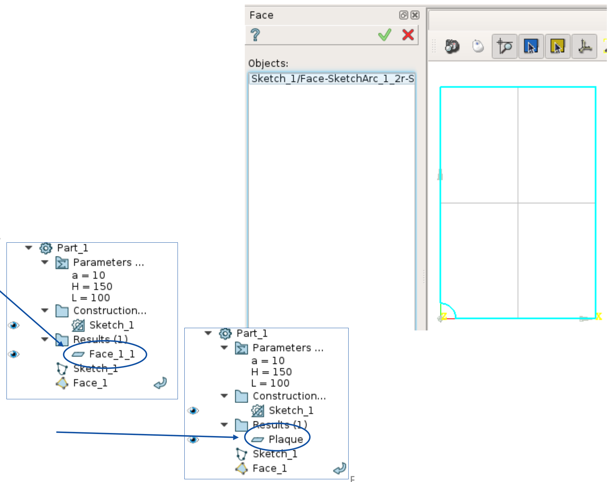
   
  <em>Slide 29 — the face lands in the results, under a Shaper code, and is
  renamed Plaque.</em>

#### Les groupes

- Les groupes
  - Menu `"Features/Group"`
  - Création par un nom, le type et la désignation dans la vue graphique.
- Chaque groupe est identifié dans l'arbre d'études et est visualisable séparément

  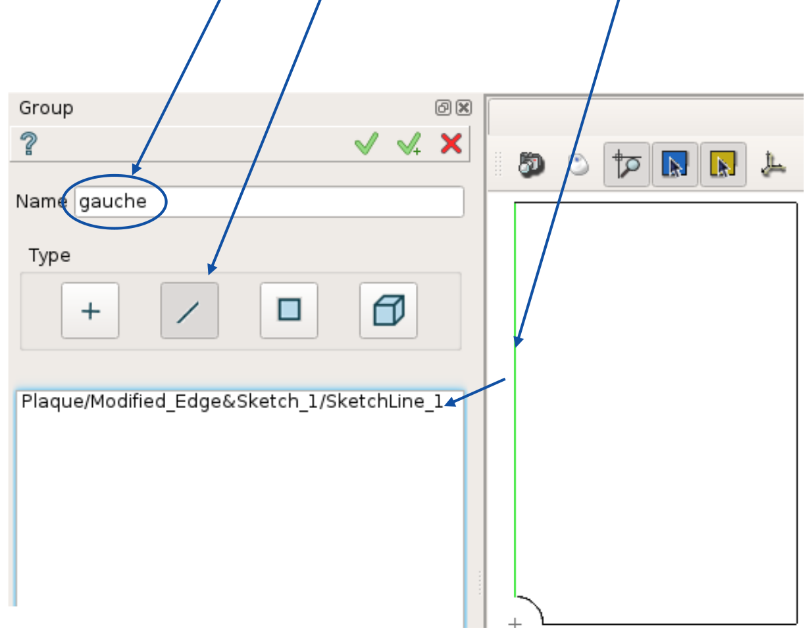
  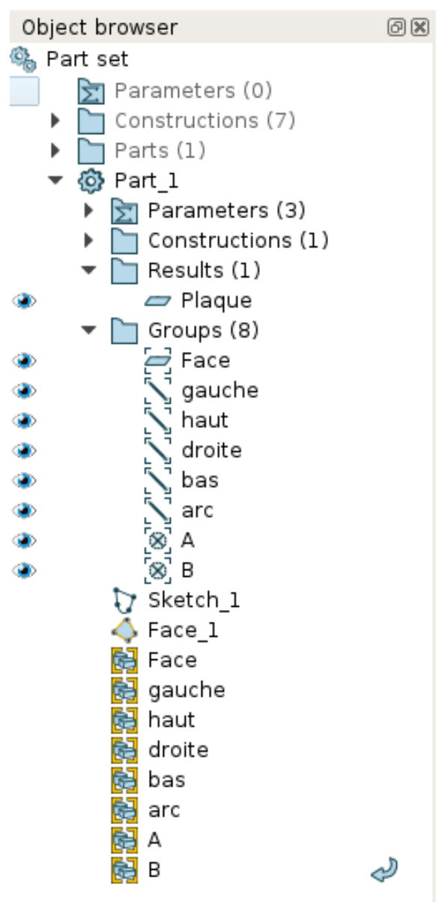
   
  <em>Slide 30 — a group is a name, a type and a selection; each one is listed
  separately in the study tree.</em>

### Le maillage : algorithme et hypothèses

#### Création du maillage, activation du module SMESH

- Création du maillage : activation du module SMESH
  - La « création » du maillage crée en fait un objet de type « maillage » qu'il
    faudra ensuite qualifier.
  - On désigne l'objet géométrique voulu, puis deux méthodes :
    - Avec le menu déroulant `"Mesh"`,
    - Ou graphiquement avec l'icone ad-hoc.
  - *Remarque : dans la fenêtre qui apparaît, SMESH a reconnu qu'il n'y avait que
    des surfaces dans la géométrie et a inactivé le choix 3D.*
- Le maillage peut être renommé.

  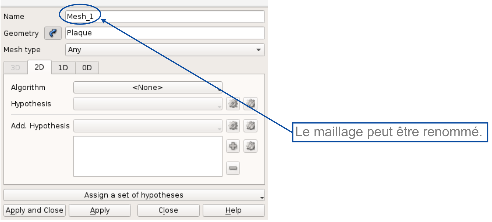
  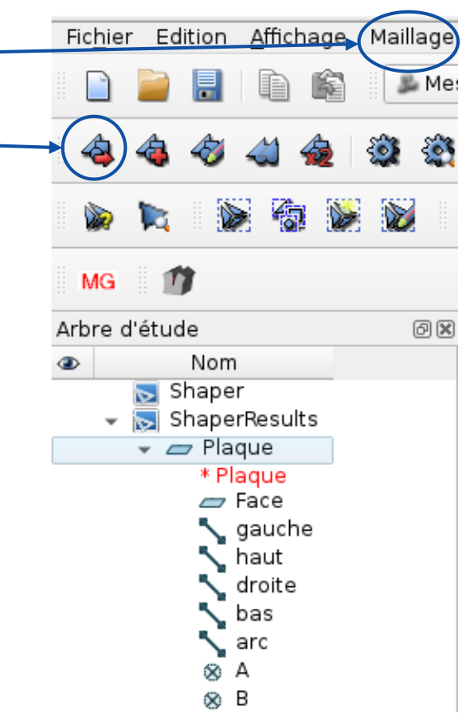
   
  <em>Slide 31 — SMESH has seen only surfaces in the geometry and greyed out the
  3D choice.</em>

#### Choix de l'algorithme

- Choix de l'algorithme
  - On choisit MG-CADSurf dans la liste des algorithmes possibles.
  - Constat :
    - On aurait pu choisir `"Triangular"` dans le type de maille, mais c'est
      inutile ici car le choix aura lieu dans la définition ultérieure des
      hypothèses.
    - Le choix 1D est inactivé, car cet algorithme *(comme NETGEN 1D_2D)* maille
      automatiquement les bords du domaine.

  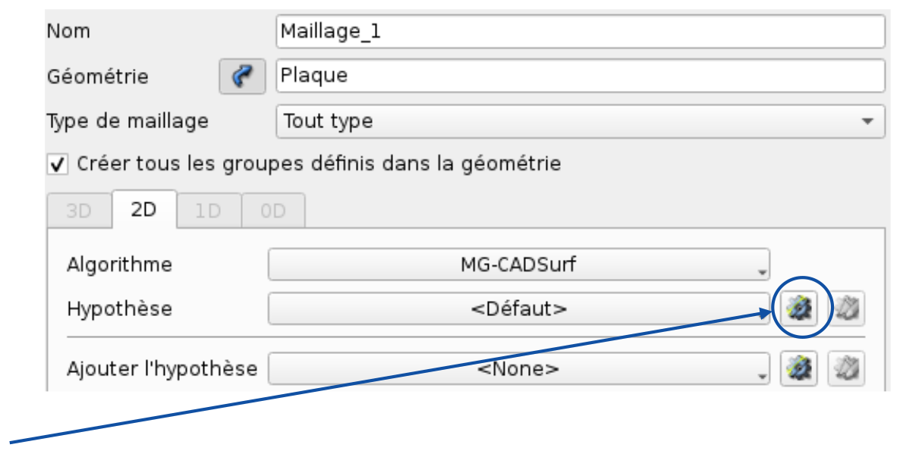
   
  <em>Slide 32 — MG-CADSurf chosen; the 1D choice is greyed out because the
  algorithm meshes the boundaries itself.</em>

#### Les hypothèses

- Les hypothèses
  - Par défaut, MG-CADSurf propose des caractéristiques plausibles. Par exemple la
    taille de maille moyenne, `"User size"`, vaut le 10ème de la diagonale.

  
   
  <em>Slide 33 — the defaults MG-CADSurf proposes, the average size a tenth of
  the diagonal.</em>

#### La taille des mailles

- La taille des mailles « physique »
  - `"User size"` est la taille moyenne que l'on veut
  - `"Min size"` et `"Max size"` sont à ajuster, par exemple /100 et *3.
- La taille des mailles « géométrique »
  - L'angle et la distance gèrent l'écart entre le segment créé et la tangente à
    la frontière.
  - *Inutile de définir ces valeurs si la géométrie ne comporte que des lignes
    droites.*
- Paramètres principaux
  - On choisit quadratique ou non.
  - Gradation : le coefficient de variation d'une maille à sa voisine ; ne pas
    toucher en général.
- Type de maille voulu

  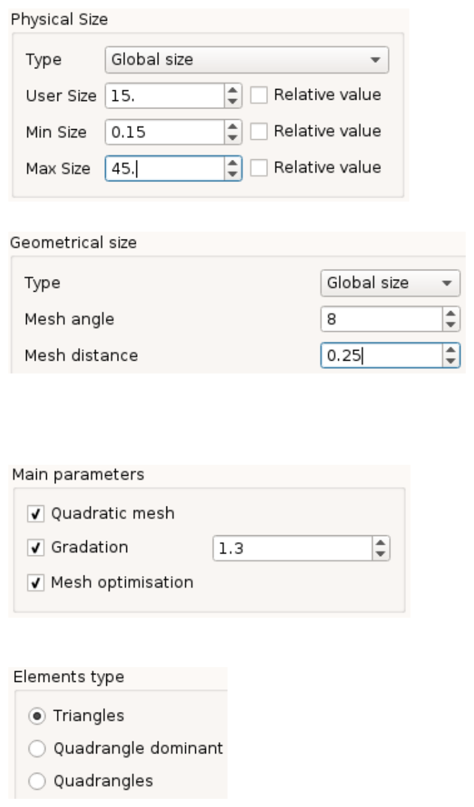
   
  <em>Slide 34 — the physical sizes, the geometrical sizes, the main parameters
  and the element type.</em>

- Les hypothèses
  - Les autres paramètres restent par défaut.
  - Valider avec `"OK"`

  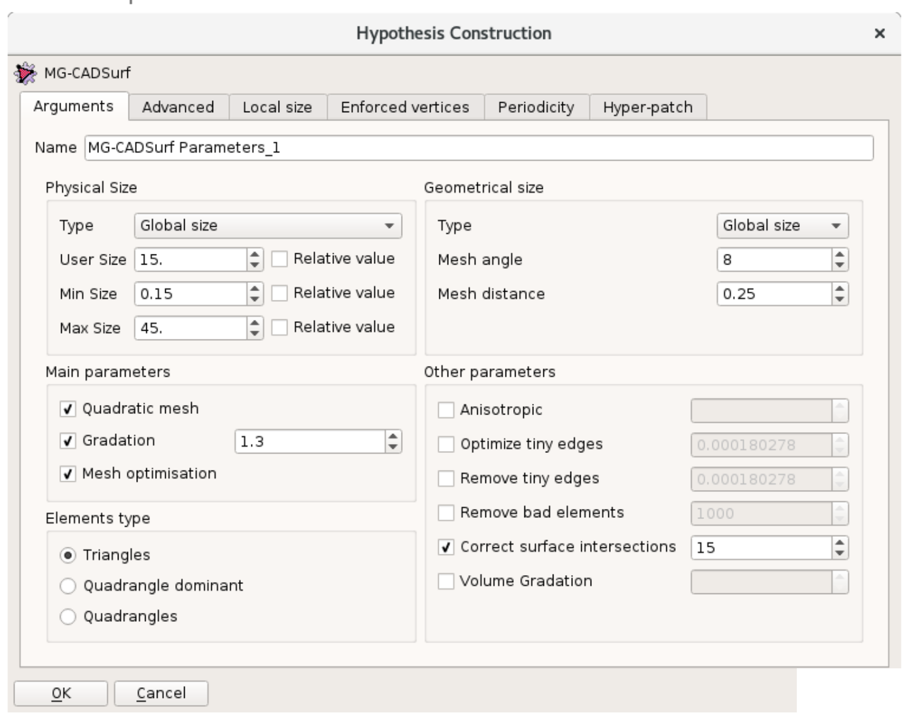
   
  <em>Slide 35 — the other parameters left at their defaults, and OK.</em>

#### Le raffinement local sur l'arc

- Le raffinement local sur l'arc
  - Onglet `"Local size"`.

  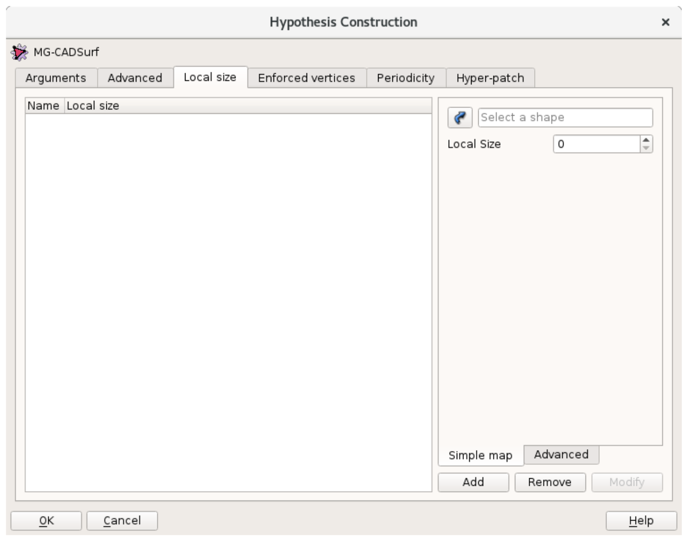
   
  <em>Slide 36 — the Local size tab, still empty.</em>

- Le raffinement local sur l'arc
  - Sélectionner le groupe géométrique correspondant à l'arc.
  - Entrer la taille de maille souhaitée
  - Après ajout, la donnée est enregistrée. Elle pourra être modifiée plus tard.

  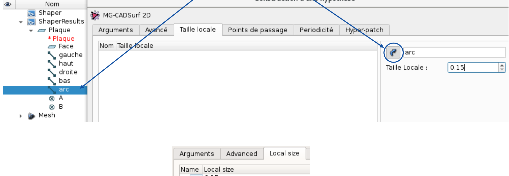
   
  <em>Slide 37 — the arc group picked and given its own mesh size, then
  recorded.</em>

#### Les groupes de mailles et de nœuds

- Les groupes, si l'option automatique n'a pas été cochée
  - Les groupes définis dans Shaper sont transférés entre l'objet géométrique et
    l'objet de maillage.
  - Dans la fenêtre `"Create Groups from Geometry"` de l'onglet `"Mesh"`, on
    sélectionne les groupes de mailles et de nœuds depuis l'arbre d'études.
  - *Remarque : à ce moment, cette opération est simplement une mise en relation
    pour les futures mailles et nœuds qui seront créés. En cas d'oubli, on peut
    aussi la faire après calcul du maillage.*

  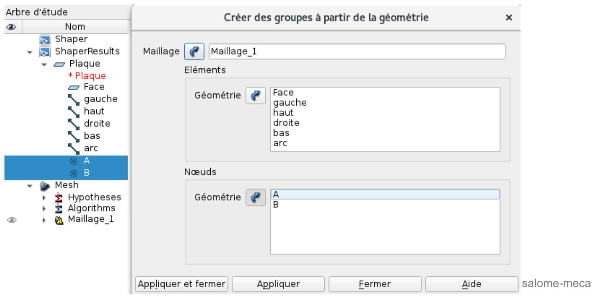
   
  <em>Slide 38 — the Shaper groups related to the mesh object, before any mesh
  exists.</em>

### Calcul et exportation

#### Après application et fermeture

- Après application et fermeture :
  - L'arbre d'études s'est enrichi de l'algorithme et des hypothèses créés.
  - On peut éditer les hypothèses pour les modifier.
  - Le symbole indique que le maillage est défini mais n'a pas encore été calculé.
- Le calcul effectif du maillage se fait en sélectionnant l'objet de maillage dans
  l'arbre d'études et :
  - Par le choix `"Compute"` de l'onglet `"Mesh"`,
  - Ou par le choix `"Compute"` avec la patte droite de la souris
  - Ou par l'icône

  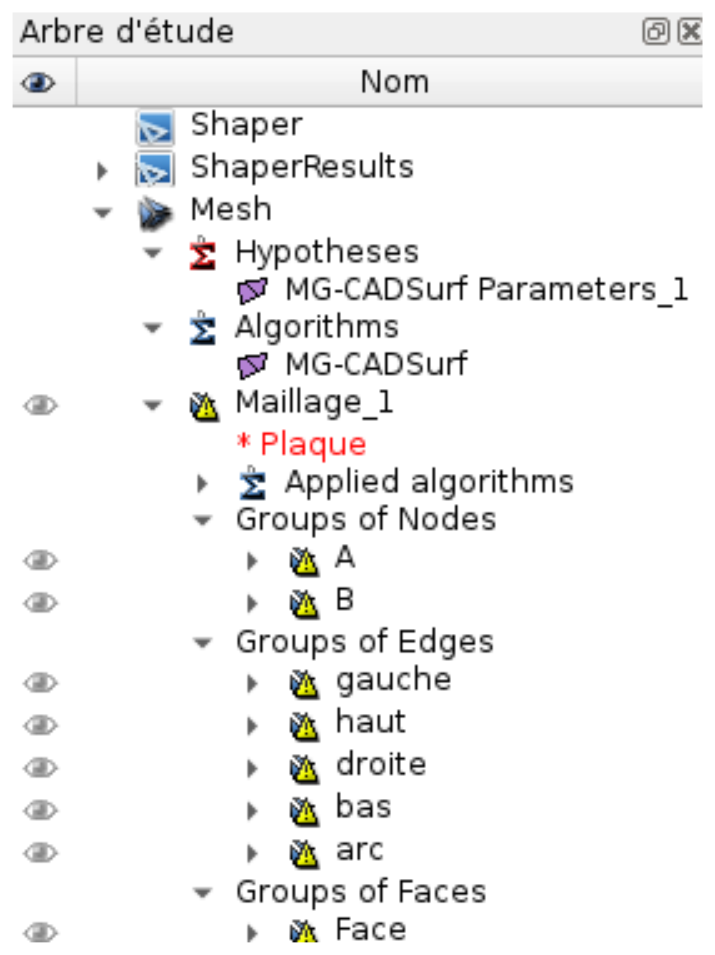
  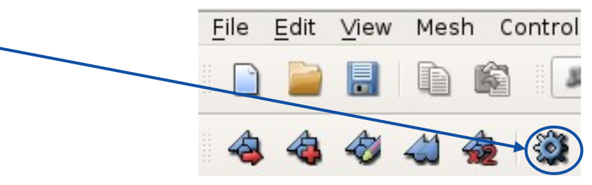
   
  <em>Slide 39 — the algorithm and hypotheses now in the tree, and the Compute
  button that runs the mesher.</em>

#### Après calcul

- Après calcul :
  - Affichage d'un tableau récapitulatif des caractéristiques du maillage.
  - *Remarque : ces algorithmes de maillage en triangles incluent une fonction de
    tirage au hasard pour l'insertion de nouveaux nœuds. Il n'est donc pas anormal
    que les nombres de nœuds et de mailles varient légèrement d'une fois sur
    l'autre.*

  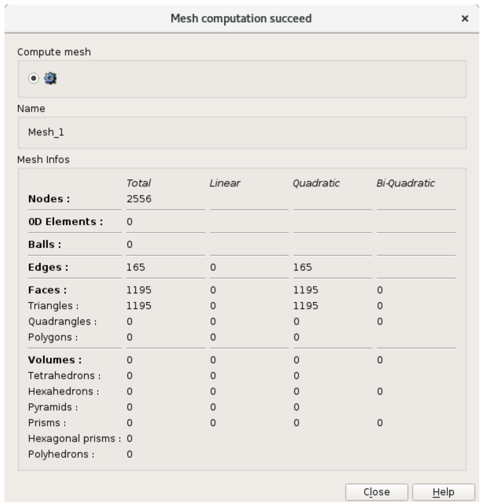
   
  <em>Slide 40 — the summary table: 2556 nodes and 1195 quadratic triangles.</em>

- Après calcul :
  - Affichage du maillage.

  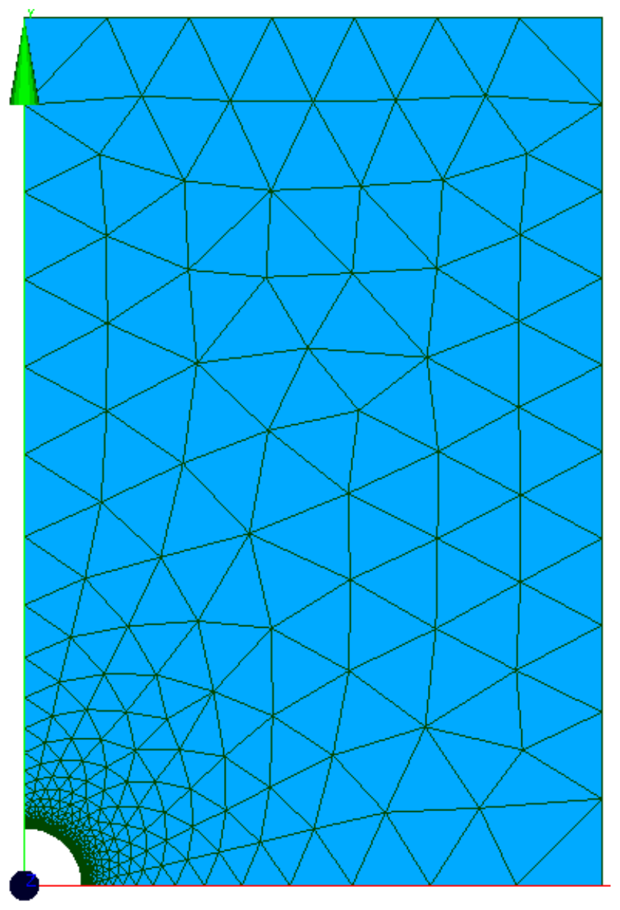
   
  <em>Slide 41 — the mesh on screen, refined at the edge of the hole.</em>

#### Exportation du maillage

- Exportation du maillage dans un fichier au format MED
  - Par le choix `"Export/MED file"` avec la patte droite de la souris.

  
   
  <em>Slide 42 — the mesh exported to a MED file.</em>

[▲ back to the five parts](#cao-et-maillage-dans-salome_meca--shaper--smesh--simvia-web-edition)

---

## Part 5 · Exercice n°2

> **In this part**
> [Objectif du tube coudé](#objectif-du-tube-coud) ·
> [Données du tube coudé](#donnes-du-tube-coud) ·
> [Principe général](#principe-gnral) ·
> [Analyse](#analyse) ·
> [Les esquisses du tuyau](#les-esquisses-du-tuyau) ·
> [Le chemin et le tuyau](#le-chemin-et-le-tuyau) ·
> [Les groupes du tuyau](#les-groupes-du-tuyau) ·
> [Le maillage : algorithmes et sous-maillages](#le-maillage--algorithmes-et-sous-maillages) ·
> [Calcul et exportation du maillage](#calcul-et-exportation-du-maillage)
>
> *Original deck: slides 43–71.*

### Objectif du tube coudé

- Un tube coudé
- Objectif :
  - Maillage en hexaèdres
  - Linéaire
  - Groupes sur les faces de bord
  - Groupe pour un nœud pour le post-traitement

  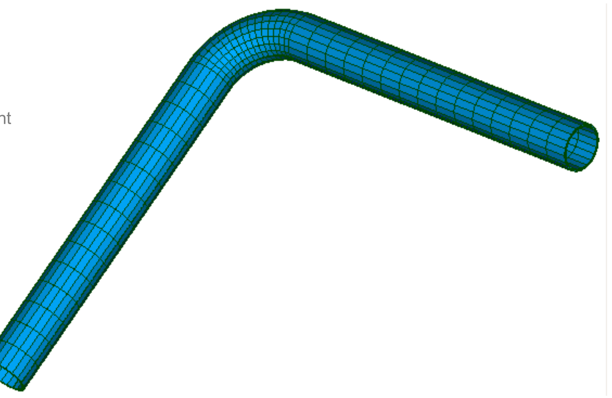
   
  <em>Slide 43 — the mesh the exercise builds: linear hexahedra on an elbowed
  pipe.</em>

### Données du tube coudé

- Groupes de faces :
  - `Base`, `Efond` : section du tuyau
  - `Surfint`, `Surfext` : surfaces intérieure et extérieure du tuyau
- Groupe de nœud :
  - `B` : sur la section `Efond` et sur la surface interne du tuyau
- Tailles de maille :
  - 15 segments sur chacun des tronçons le long du tuyau
  - 20 segments sur la périphérie
  - 2 segments dans l'épaisseur

  
   
  <em>Slide 44 — the dimensions, the four face groups and the node group B.</em>

### Principe général

- Méthode à employer :
  - Créer la surface de base
  - Créer l'axe moyen du tuyau
  - Propager la surface de base le long de l'axe moyen

  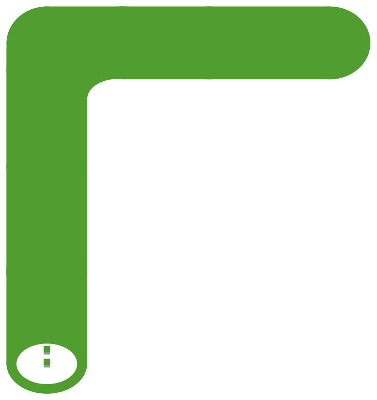
   
  <em>Slide 45 — the base surface swept along the centre line of the pipe.</em>

### Analyse

#### Réduire chaque surface à un carré

- Mailler les volumes en hexaèdres suppose de mailler les surfaces en quadrangles,
  donc :
  - Chaque surface est réductible à un carré.
  - Les discrétisations sont les mêmes pour deux arêtes en vis-à-vis pour ce carré.
- Il faut donc anticiper cela au moment de la création de la CAO
  - Par un dessin spécifique
  - Par des partitions
  - …

  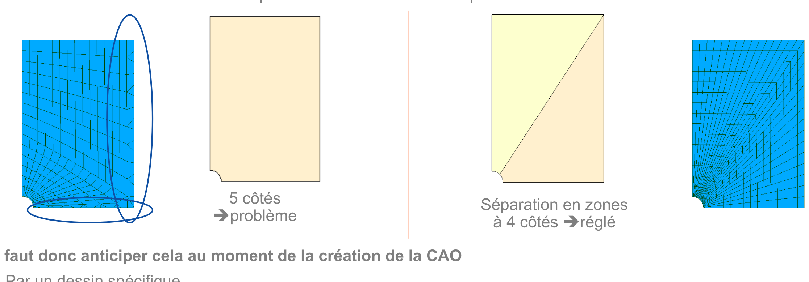
   
  <em>Slide 46 — a five-sided face is a problem; split into four-sided zones it
  is solved.</em>

#### La ligne de couture

- Subtilité de la ligne de couture…
  - Un cylindre, et plus généralement une forme extrudée à partir d'une courbe
    fermée, n'a pas sa surface « lisse ».
  - Il existe toujours une ligne de « couture » :
- Positionnement de cette ligne
  - Pour les plans de départ canoniques, c'est du côté du premier axe dans la
    permutation circulaire (X,Y,Z) :
    - XOY et extrusion selon Z → X+
    - YOZ et extrusion selon X → Y+
    - XOZ et extrusion selon Y → Z+
  - Pour un autre plan, je ne sais pas !
- Conséquence pour le maillage
  - Une arête sera automatiquement créée sur cette ligne de couture. Elle
    délimitera ainsi une surface à 3 côtés.

  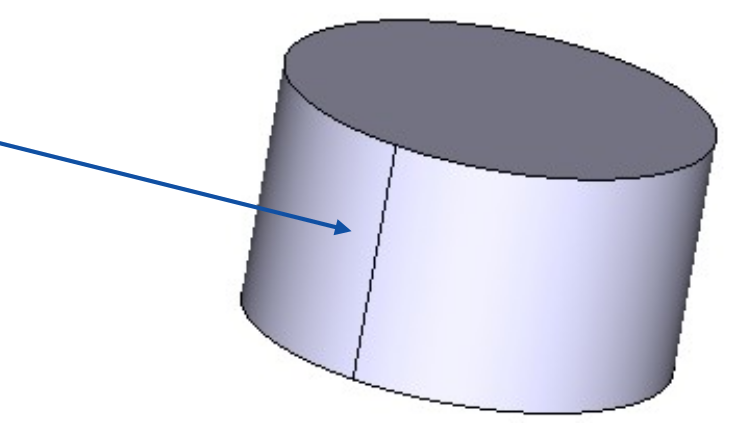
   
  <em>Slide 47 — the seam line an extruded closed curve always carries.</em>

#### Dans notre cas

- Dans notre cas :
  - Il faut gérer le découpage en surfaces à 4 côtés…
    - Donc découper le disque de base
  - en ayant en tête la future ligne de couture,
    - Le cercle de base est dans le plan XOZ et on extrudera selon Y → couture en Z+
  - et le nœud pour le groupe `B`.
    - Dans le cercle, de base, il doit y avoir une coupure en X+ du côté intérieur.
- Conséquences
  - La coupure pour le futur nœud est à l'intérieur du cylindre. Mais pour garder
    la correspondance entre l'intérieur et l'extérieur, il faut aussi insérer un
    point à l'extérieur, en vis-à-vis.
  - On ajoutera donc un découpage en créant un segment qui les joint.

  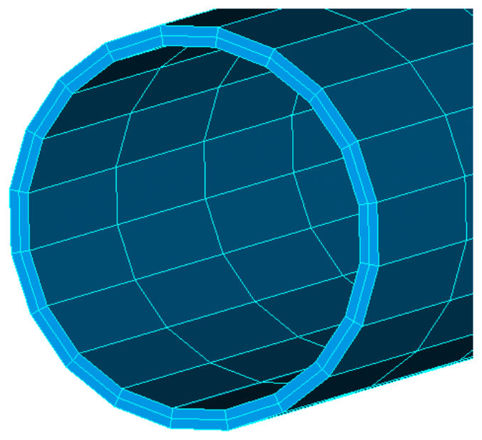
  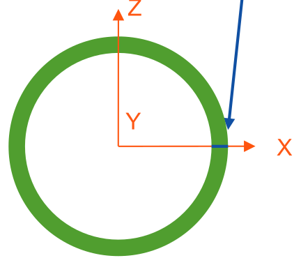
   
  <em>Slides 48 and 49 — the base disc cut at X plus, on the inside, for the
  future node of group B.</em>

#### La coupure de l'extrusion

- Mais la coupure de l'extrusion…
  - Ne s'applique qu'aux surfaces nouvellement créées. La base est inchangée est
    reste une surface à 3 côtés.
  - On insère donc une autre coupure de la base et on la place en regard de ce qui
    sera la couture de l'extrusion.
- C'est correct, mais…
  - La ligne périphérique sera coupée en deux tronçons inégaux et les hypothèses
    de maillage seront moins simples à appliquer.
  - On coupe donc en 4 :
- Il faudra prévoir des groupes pour définir le nombre de segments au bord du disque
  - `d1` : un des segments de coupure
  - `L1` : la périphérie

  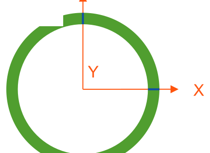
  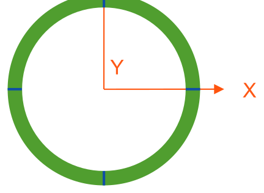
   
  <em>Slide 49 — a second cut facing the future seam, then four equal cuts so the
  meshing hypotheses stay simple.</em>

### Les esquisses du tuyau

#### Activer le module SHAPER, créer une nouvelle pièce

- Activer le module SHAPER
- Créer une nouvelle pièce (part)
- Elle apparaît dans le browser, avec ces rubriques, vides au démarrage :
  - `Paramètres` : ceux de la future pièce.
  - `Constructions` : les différentes esquisses, plans, axes, etc. nécessaires au
    fur et à mesure.
  - `Résultats` : le ou les dernières parties créées pour constituer la pièce.
    Cette rubrique se remplit et se vide au fur et à mesure des opérations.

  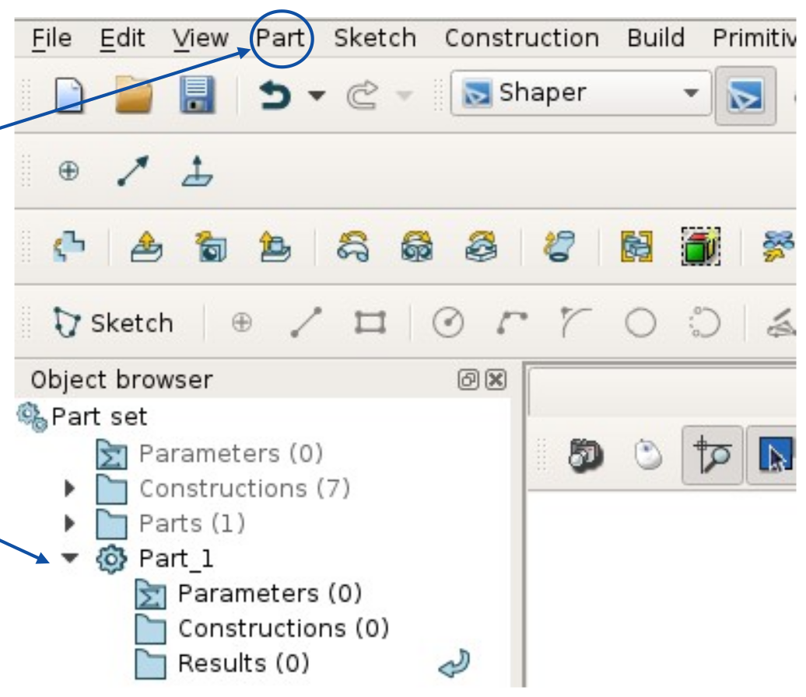
   
  <em>Slide 50 — a new part for the second exercise, its three sections still
  empty.</em>

#### Créer une esquisse dans le plan XOZ

- Créer une esquisse (sketch)
- Choisir successivement :
  - La taille ; c'est une estimation pour cadrer la vue. En gros c'est le côté
    d'un carré qui contient le futur dessin.
    - *Se tromper n'est pas grave mais simplement désagréable car il faudra faire
      des recadrages en visualisation.*
  - Le plan : celui sur lequel on va dessiner. La feuille de papier en quelque
    sorte. On choisit l'un des 3 plans XOY, YOZ ou XOZ, soit en le désignant à la
    souris dans la fenêtre graphique, soit en le sélectionnant dans la liste du
    browser. Pour cet exercice, on choisit XOZ.
  - On valide.
- *Remarque :*
  - *Pour des CAO 3D compliquées, on pourra choisir un plan qui est une face de
    l'objet en cours de création ou un plan que l'on aura créé spécialement. Cela
    permet de positionner l'esquisse que l'on dessine directement à sa place dans
    l'espace 3D*

  
  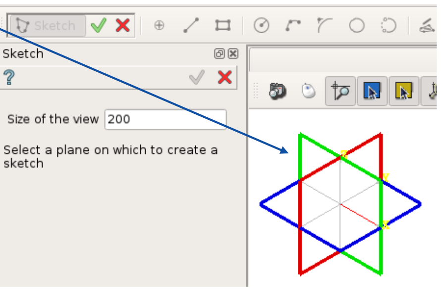
   
  <em>Slide 51 — the same two steps, this time choosing the XOZ plane.</em>

#### Dessiner les deux cercles

- Dessiner à main levée les deux cercles
  - On pique le centre (clic gauche), on écarte la souris, clic gauche pour finir.
  - Respecter grosso modo la position et les dimensions.
  - Placer le centre du bon côté des axes.
- Bilan
  - Il y a 6 degrés de liberté, 3 pour chaque cercle :
    - les 2 coordonnées du centre
    - le rayon.

  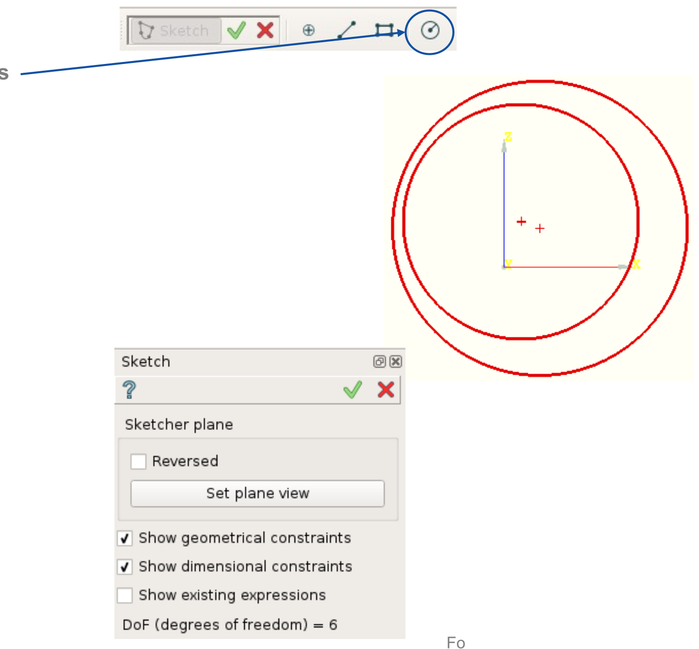
   
  <em>Slide 52 — the two circles drawn freehand, six degrees of freedom.</em>

#### Contraintes de positionnement et de dimension

- Contraintes de positionnement
  - Le centre des cercles sont sur l'origine (-4 ddl)
- Contraintes de dimension
  - La valeur actuelle s'affiche en bleu
  - La valeur voulue peut être définie de 3 façons :
    - Brute : non modifiable ensuite.
    - Avec un paramètre défini auparavant.
    - En définissant un nouveau paramètre avec son nom et sa valeur ; ce paramètre
      sera utilisable à nouveau si besoin.
- Bilan :
  - L'esquisse passe au vert (0 ddl)

  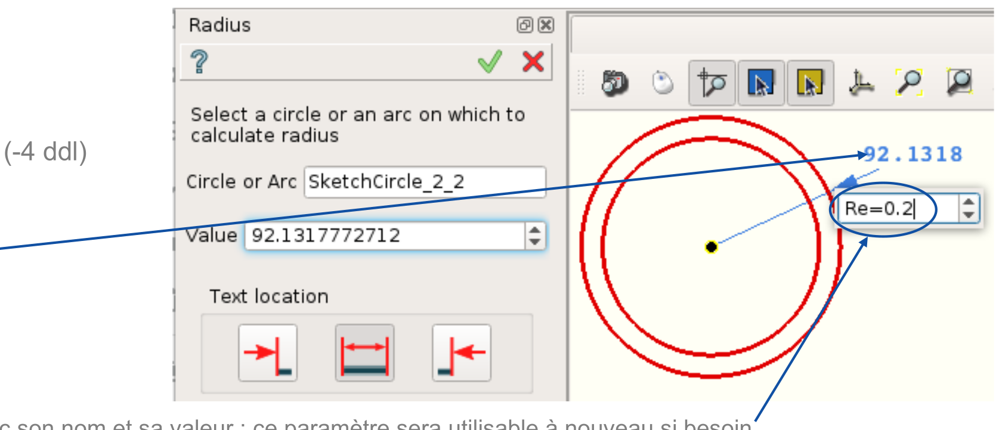
   
  <em>Slide 53 — the current radius in blue, the wanted one entered as the
  parameter Re.</em>

  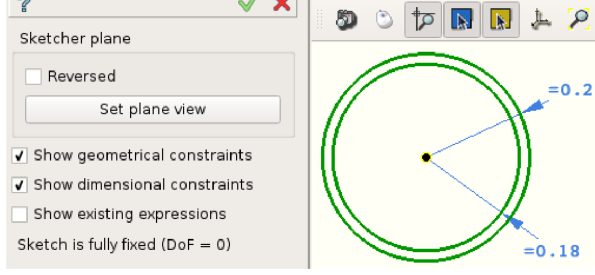
   
  <em>Slide 53 — both centres on the origin and both radii set: the sketch turns
  green.</em>

#### Tracer les coupures

- Tracer la première coupure
  - Piquer un point sur le cercle extérieur pas très loin de l'objectif ; le
    cercle passe en bleu.
  - Puis piquer un point sur le cercle intérieur, grosso modo où on veut arriver ;
    le cercle passera au bleu.
  - Touche `"Echap"` pour arrêter le tracé.
  - La ligne existe avec ses deux extrémités en jaune pour signifier qu'elles sont
    attachées au cercle.
- Bilan
  - Il y a 2 degrés de liberté : position de chaque extrémité sur leur cercle
    respectif.
- Deux possibilités
  - On contraint chaque point à appartenir à l'axe Ox.
  - Ou on déclare que l'origine appartient à la droite et que la droite est
    horizontale.

  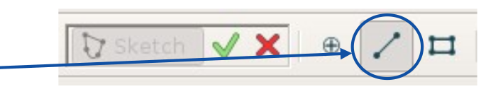
   
  <em>Slide 54 — the line tool, used to draw the cut.</em>

  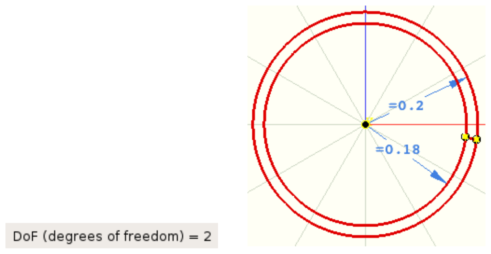
   
  <em>Slide 54 — the first cut drawn between the two circles, its ends yellow
  because they are attached.</em>

- Procéder de la même façon pour les autres coupures
- Fin des contraintes :
  - L'esquisse passe au vert (0 ddl)
  - Affichage des dimensions sous deux aspects :
    - La valeur prescrite.
    - La nom du paramètre, le cas échéant.

  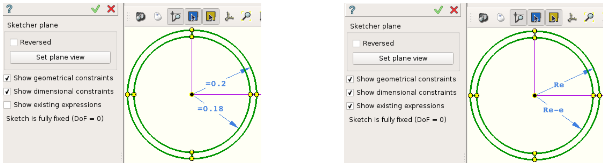
   
  <em>Slide 55 — all four cuts constrained, the dimensions shown as values then
  as parameter names.</em>

#### Le tracé du chemin

- Créer une esquisse (sketch) dans le plan XOY
- Dessiner à main levée le tracé du chemin
  - Respecter grosso modo les formes et les dimensions.
  - Se placer du bon côté des axes.
  - Pour arrêter : touche `"Echap"`
- Ajouter l'arrondi par un congé
  - Piquer l'angle
- 7 degrés de liberté au final
  - Position des extrémités (2x2ddl)
  - Longueur des segments droits (+2ddl)
  - Angle entre les segments (+1ddl)

  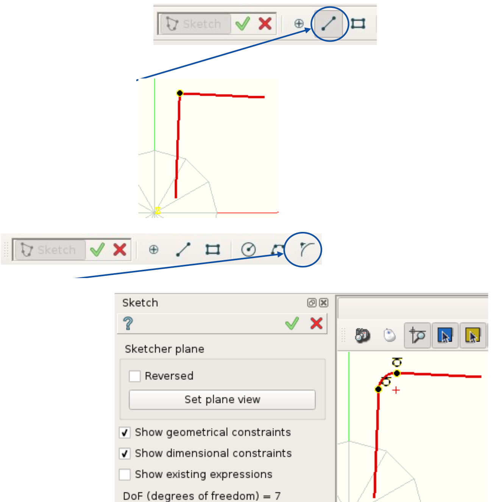
   
  <em>Slide 56 — the path drawn freehand, then the corner rounded by a
  fillet.</em>

- Contraintes pour éliminer les 7 degrés de liberté
  - L'origine est confondue avec la 1ère extrémité (-2ddl)
  - Le 1er segment est vertical (-1ddl)
  - Longueur du 1er segment (-1ddl)
  - Rayon du congé (-1ddl)
  - Longueur du 2nd segment identique au 1er (-1ddl)
  - Angle entre les segments (-1ddl)
- Remarque
  - Les degrés de liberté que l'on constate ne sont pas forcément ceux qui sont
    directement éliminés.
  - Par exemple ici, contraindre le 1er segment à être vertical revient à imposer
    la coordonnée x de sa seconde extrémité.

  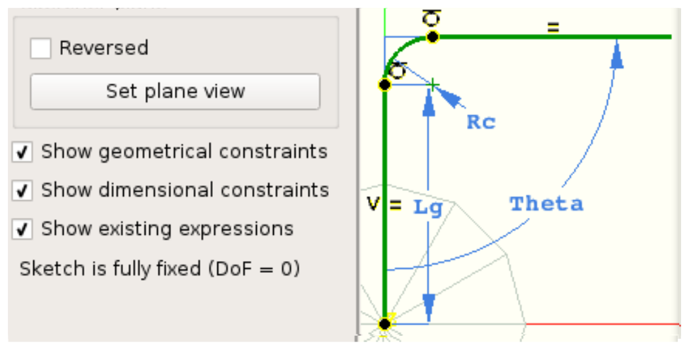
   
  <em>Slide 57 — the seven degrees of freedom removed, the path fixed by Lg, Rc
  and Theta.</em>

### Le chemin et le tuyau

#### Créer le chemin

- Créer le chemin
  - Menu `"Build/Wire"`
  - Sélectionner les 3 lignes
- Dans l'arbre d'études :
  - Le chemin est inséré dans la rubrique des résultats.
  - Il peut être renommé *(comme tous les autres objets identifiés dans l'arbre
    d'études d'ailleurs)*.

  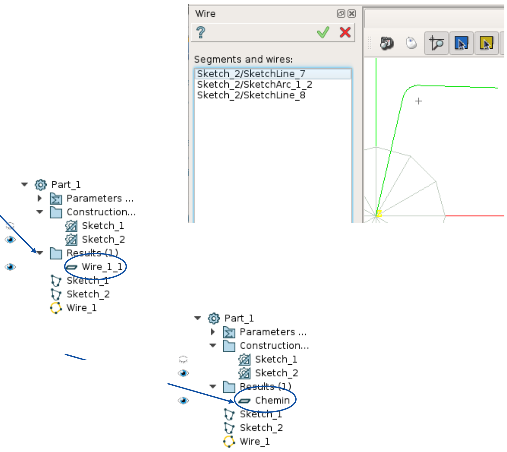
   
  <em>Slide 58 — the three lines built into a wire, then renamed Chemin.</em>

#### Créer le tuyau

- Créer le tuyau
  - Menu `"Features/pipe"`
  - Les objets de la base sont les 4 surfaces du disque.
  - *Attention à ne pas sélectionner toute l'esquisse sinon le disque central sera
    pris également.*
  - Le chemin est le « wire » créé précédemment.

  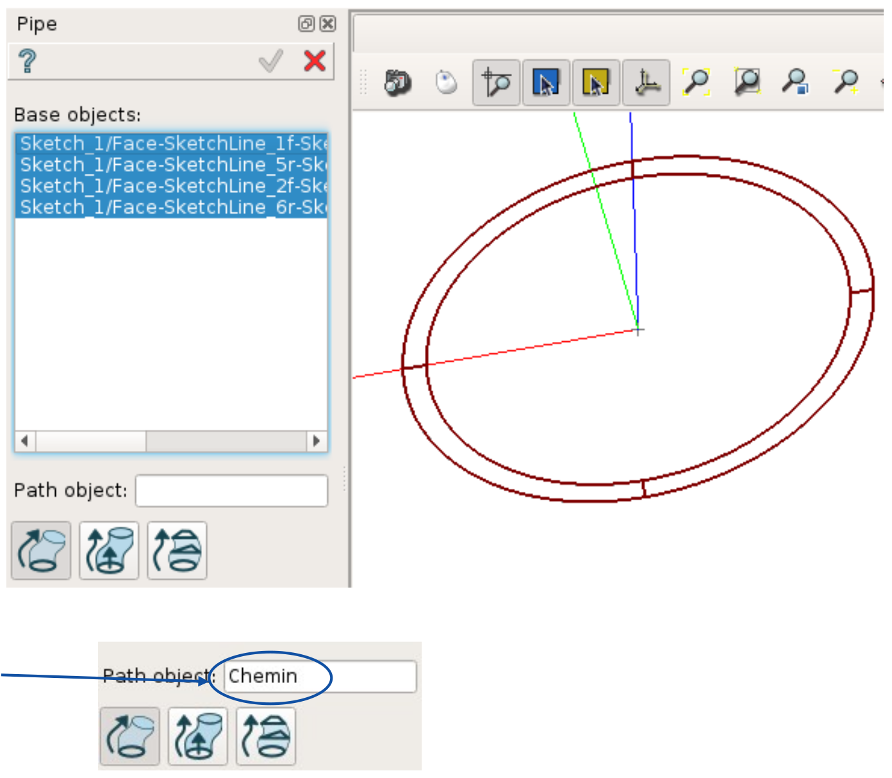
   
  <em>Slide 59 — the four base surfaces swept along the wire named Chemin.</em>

### Les groupes du tuyau

- Les groupes
  - Menu `"Features/Group"`
  - Création par un nom, le type et la désignation dans le résultat
- Chaque groupe est identifié dans l'arbre d'études et est visualisable séparément
- Quels groupes ?
  - Pour le calcul : `Base`, `Efond`, `Surfext`, etc.

  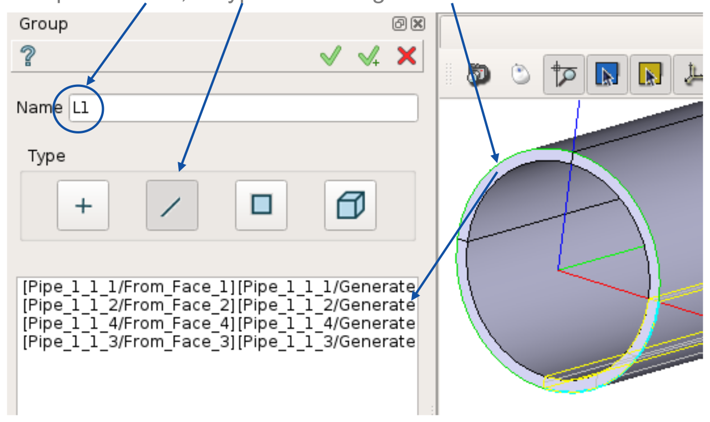
  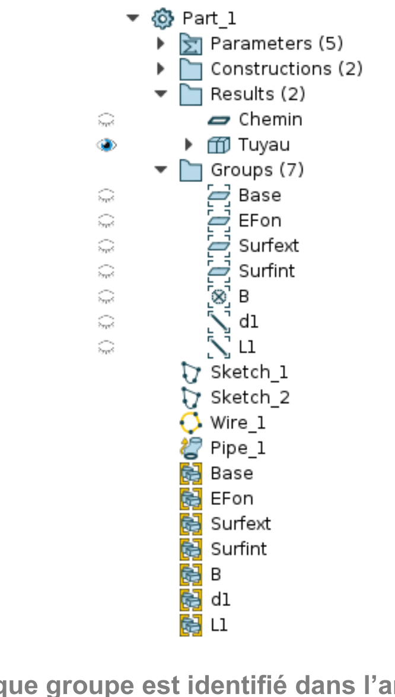
   
  <em>Slide 60 — a group named, typed and picked on the result; each one listed
  separately in the tree.</em>

### Le maillage : algorithmes et sous-maillages

#### Création du maillage, activation du module SMESH

- Création du maillage : activation du module SMESH
  - La « création » du maillage crée en fait un objet de type « maillage » qu'il
    faudra ensuite qualifier.
  - On désigne l'objet GEOM voulu, puis deux méthodes :
    - Avec le menu déroulant `"Mesh"`,
    - Ou graphiquement avec l'icone ad-hoc.
- Le maillage peut être renommé.

  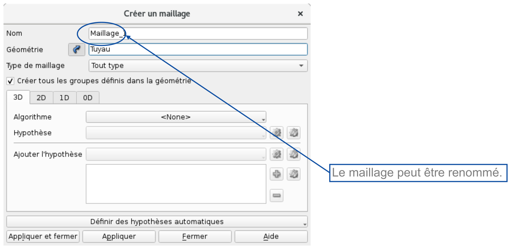
  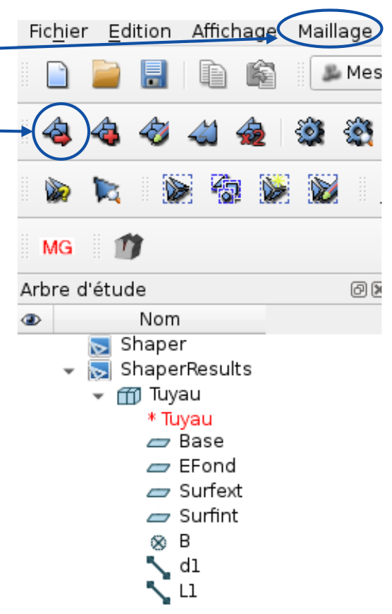
   
  <em>Slide 61 — the pipe designated, and the mesh object created and renamed.</em>

#### Choix des algorithmes 3D et 2D

- Choix des algorithmes 3D et 2D
  - On choisit Hexahedron (i,j,k) dans la liste des algorithmes possibles pour le 3D.
    - Pas d'hypothèses particulière : les hexaèdres sont bâtis à partir des
      quadrangles créés sur les faces.
  - Puis « Quadrangle: Mapping » pour les surfaces.
    - Pas d'hypothèse particulière : le quadrillage est fait à partir des
      discrétisations des bords 1D.

  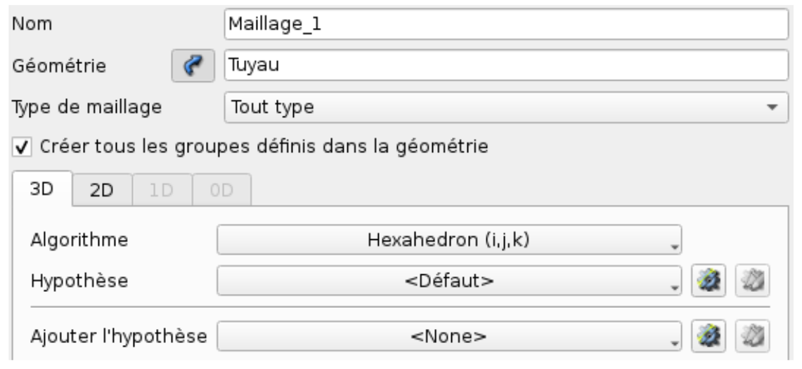
  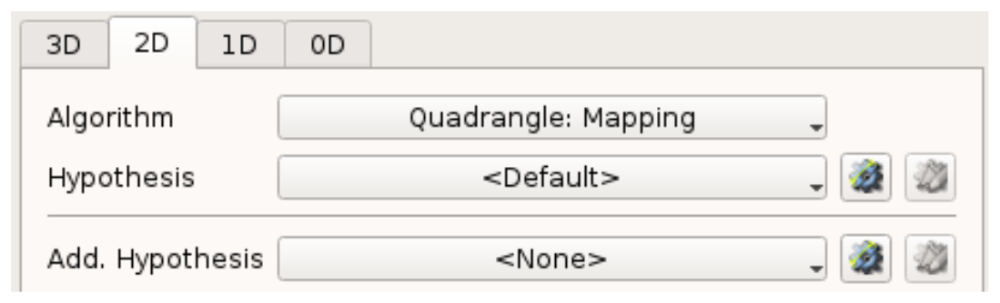
   
  <em>Slide 62 — Hexahedron for the volumes, Quadrangle Mapping for the surfaces,
  neither needing a hypothesis.</em>

#### Choix de l'algorithme 1D

- Choix de l'algorithme 1D
  - On a 3 modes de discrétisation :
    - Le long du tuyau.
    - La périphérie du tuyau.
    - L'épaisseur du tuyau.
  - On choisit de définir globalement la discrétisation le long du tuyau, voulue à
    15 segments par arête : le 1er tronçon, le virage, le 2nd tronçon.
  - Les autres sont gérés par des sous-maillages.
- Algorithme 1D global
  - Discrétisation des arêtes en 15 segments équirépartis

  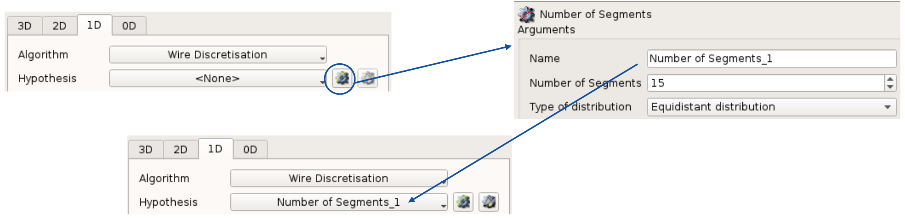
   
  <em>Slide 63 — the global 1D rule: fifteen equally spaced segments per edge
  along the pipe.</em>

#### Sous-maillage dans l'épaisseur

- Sous-maillage dans l'épaisseur
  - La création d'un sous-maillage se fait en sélectionnant l'objet de maillage
    dans l'arbre d'études et :
    - Par le choix `"Create Sub-mesh"` de l'onglet `"Mesh"`,
    - Ou par le choix `"Create Sub-mesh"` avec la patte droite de la souris
    - Ou par l'icône
- Support du sous-maillage : le groupe géométrique

  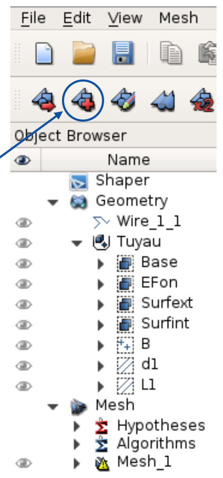
  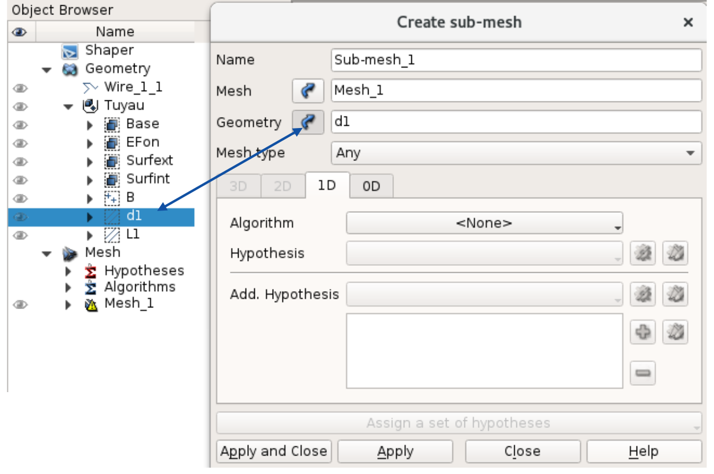
   
  <em>Slide 64 — a sub-mesh created on the geometrical group d1.</em>

- Sous-maillage 1D dans l'épaisseur
  - Discrétisation de l'arête liée au groupe `d1` en 2 segments.
  - Pour la cohérence du maillage, il faut propager cette hypothèse sur toutes les
    arêtes qui lui sont parallèles.

  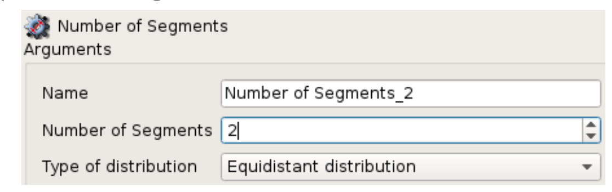
   
  <em>Slide 65 — two segments across the thickness.</em>

  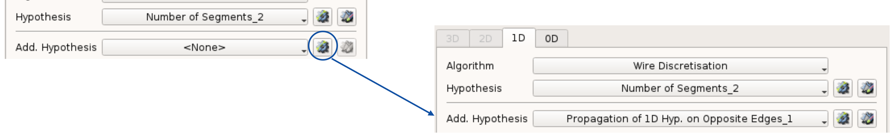
   
  <em>Slide 65 — the hypothesis propagated to every parallel edge.</em>

#### Sous-maillage dans la périphérie

- Sous-maillage 1D dans la périphérie
  - Discrétisation du bord lié au groupe `L1` en 20 segments.
  - Même technique que pour `d1` mais attention : on veut 20 segments sur la
    périphérie. Le groupe `L1` est formé de 4 arêtes de même longueur donc on aura
    5 segments sur chacune d'elles.
  - *Remarque : c'est ici que l'on apprécie d'avoir coupé la face de base en
    4 parties égales…*

  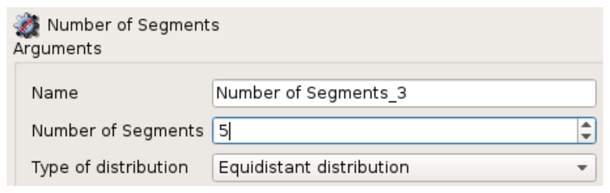
   
  <em>Slide 66 — five segments on each of the four equal edges of L1, twenty
  around the periphery.</em>

#### Les groupes de mailles et de nœuds

- Les groupes, si l'option automatique n'a pas été cochée
  - Les groupes définis dans Shaper sont transférés entre l'objet géométrique et
    l'objet de maillage.
  - Dans la fenêtre `"Create Groups from Geometry"` de l'onglet `"Mesh"`, on
    sélectionne les groupes de mailles et de nœuds depuis l'arbre d'études.
  - *Remarque : ici, cette opération est simplement une mise en relation pour les
    futures mailles et nœuds qui seront créés. En cas d'oubli, on peut aussi la
    faire après le calcul du maillage.*

  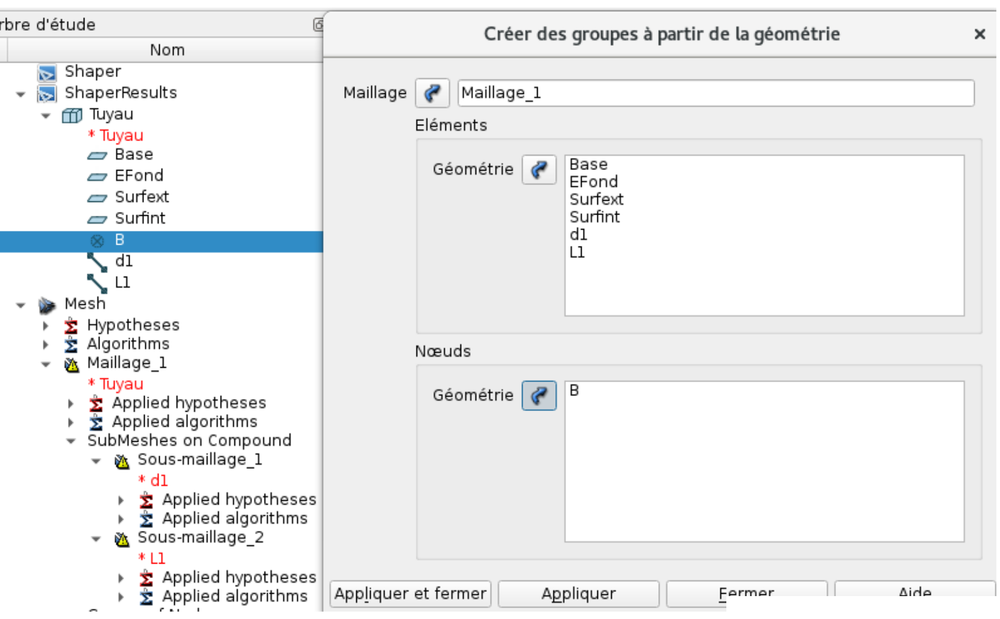
   
  <em>Slide 67 — the pipe's groups related to the mesh object, nodes and elements
  apart.</em>

### Calcul et exportation du maillage

#### Après application et fermeture

- Après application et fermeture :
  - L'arbre d'études s'est enrichi de l'algorithme et des hypothèses créés.
  - On peut éditer les hypothèses pour les modifier.
  - Les symboles indiquent que le maillage est défini mais n'a pas encore été calculé.
- Le calcul effectif du maillage se fait en sélectionnant l'objet de maillage dans
  l'arbre d'études et :
  - Par le choix `"Compute"` de l'onglet `"Mesh"`,
  - Ou par le choix `"Compute"` avec la patte droite de la souris
  - Ou par l'icône

  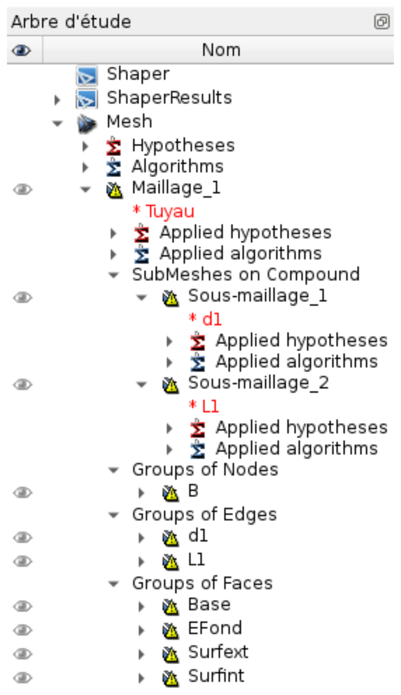
  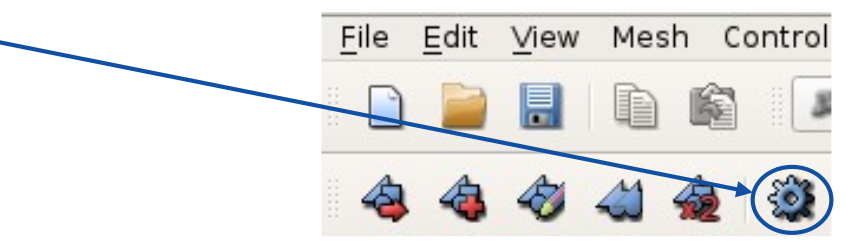
   
  <em>Slide 68 — the two sub-meshes and every group in the tree, and the Compute
  button.</em>

#### Après calcul

- Après calcul :
  - Affichage d'un tableau récapitulatif des caractéristiques du maillage.

  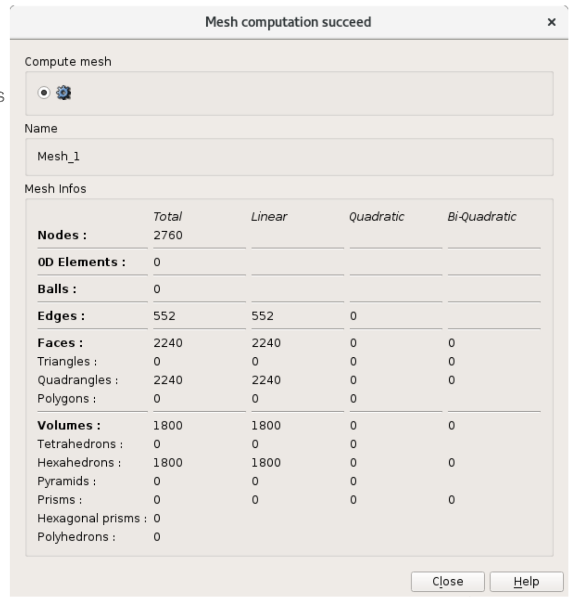
   
  <em>Slide 69 — the summary table: 2760 nodes, 2240 quadrangles and 1800 linear
  hexahedra.</em>

- Après calcul :
  - Affichage du maillage.

  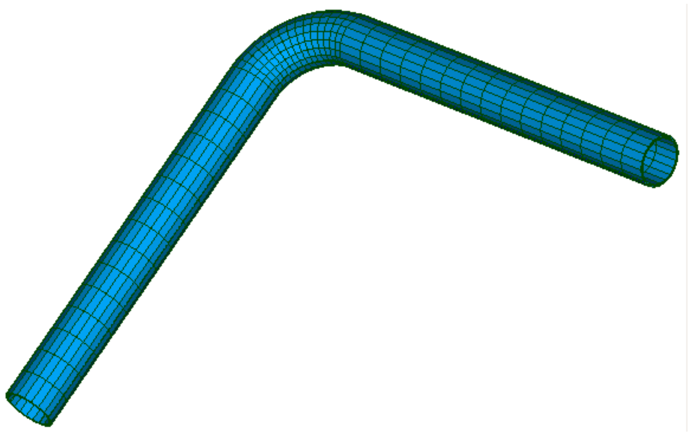
   
  <em>Slide 70 — the hexahedral mesh on screen.</em>

#### Exportation du maillage

- Exportation du maillage dans un fichier au format MED
  - Par le choix `"Export/MED file"` avec la patte droite de la souris.

  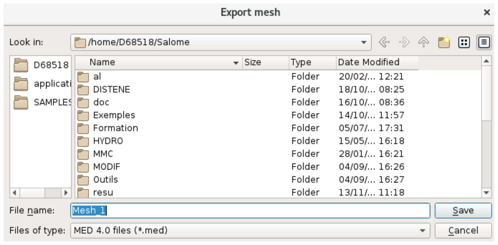
   
  <em>Slide 71 — the pipe mesh exported to a MED file.</em>

[▲ back to the five parts](#cao-et-maillage-dans-salome_meca--shaper--smesh--simvia-web-edition)

---

Merci !

---

## History

- **CAO et maillage dans salome_meca : SHAPER & SMESH** — *code_aster /
  salome_meca* course material by Gérald NICOLAS and Soizic PERON, EDF R&D
  PERICLES, authored and published by EDF S.A. under the GNU Free Documentation
  License, distributed as a slide deck. Its Title Page states no year; the deck
  carries the notice `Copyright 2021 EDF`.
- **CAO et maillage dans salome_meca : SHAPER & SMESH — Simvia web edition**,
  2026, modified and published by Simvia. Converted from the slide deck into a
  web page: text and figures unchanged, layout new.
  <https://simvia-tech.github.io/tutorials-code_aster/>

## GNU Free Documentation License

The full text of the license is in [LICENSE](../../LICENSE) at the root of this
repository.
